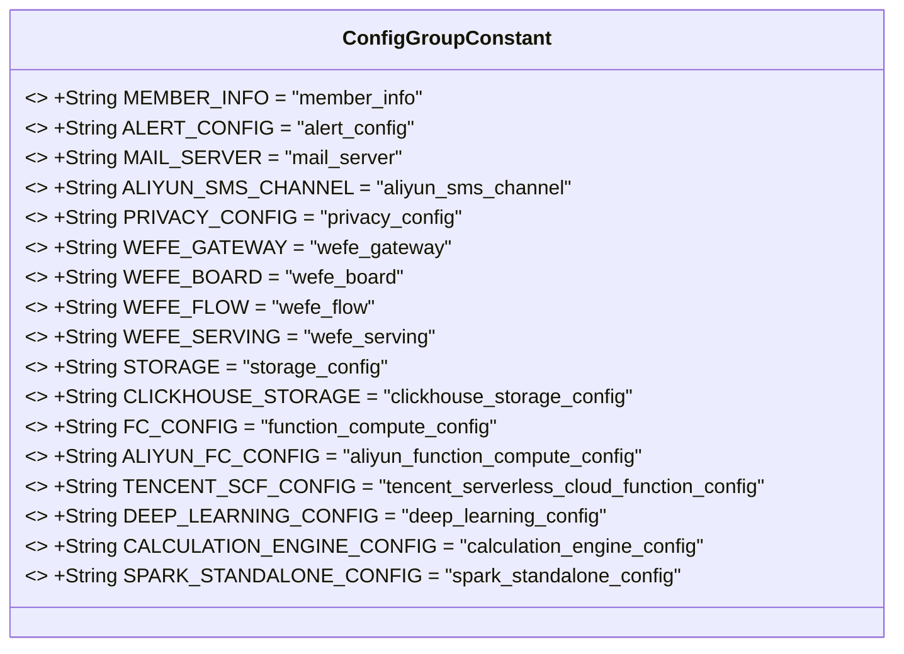

# 基础信息

|      |      |
|------|------|
| 名称 | ConfigGroupConstant |
| 编码语言 | .java |
| 代码路径 | WeFe/common/java/common-wefe/src/main/java/com/welab/wefe/common/wefe/dto/global_config/base/ConfigGroupConstant.java |
| 包名 | com.welab.wefe.common.wefe.dto.global_config.base |
| 依赖项 | [] |
| 概述说明 | ConfigGroupConstant类定义了系统设置、子系统、依赖服务、函数计算、深度学习和计算引擎的配置组常量。 |

# 说明

该代码定义了一个名为ConfigGroupConstant的公共类，包含多个静态常量字符串，用于分类存储不同模块的配置组名称。系统设置部分包括成员信息、告警配置、邮件服务器、阿里云短信通道和隐私配置。子系统部分涵盖网关、看板、流程和服务模块。依赖服务涉及存储和ClickHouse配置。函数计算包含阿里云和腾讯云的无服务器配置。深度学习与计算引擎部分分别提供相关配置，后者还包括Spark独立模式配置。这些常量用于统一管理系统各模块的配置标识。

# 类列表 Class Summary

| 名称   | 类型  | 说明 |
|-------|------|-------------|
| ConfigGroupConstant | class | ConfigGroupConstant类定义系统设置、子系统、依赖服务、函数计算、深度学习和计算引擎的配置组常量。 |

## 类 ConfigGroupConstant

|      |      |
|------|------|
| 访问范围 | public |
| 类型 | class |
| 名称 | ConfigGroupConstant |
| 说明 | ConfigGroupConstant类定义系统设置、子系统、依赖服务、函数计算、深度学习和计算引擎的配置组常量。 |

### UML类图

这段代码定义了一个名为`ConfigGroupConstant`的常量类，包含多个静态不可变字符串常量，用于表示不同配置组的名称。这些常量按照功能分为系统设置、子系统、依赖服务、函数计算、深度学习和计算引擎六大类别，每个类别包含若干具体配置项。该类主要用于集中管理系统中各类配置的分组标识，便于统一引用和维护。所有常量均为`public static final`修饰，确保全局唯一性和不可变性。

### 内部方法调用关系图

```mermaid
graph TD
    A["类ConfigGroupConstant"]
    B["系统设置常量组"]
    C["子系统常量组"]
    D["依赖服务常量组"]
    E["函数计算常量组"]
    F["深度学习常量组"]
    G["计算引擎常量组"]

    B1["MEMBER_INFO: 'member_info'"]
    B2["ALERT_CONFIG: 'alert_config'"]
    B3["MAIL_SERVER: 'mail_server'"]
    B4["ALIYUN_SMS_CHANNEL: 'aliyun_sms_channel'"]
    B5["PRIVACY_CONFIG: 'privacy_config'"]

    C1["WEFE_GATEWAY: 'wefe_gateway'"]
    C2["WEFE_BOARD: 'wefe_board'"]
    C3["WEFE_FLOW: 'wefe_flow'"]
    C4["WEFE_SERVING: 'wefe_serving'"]

    D1["STORAGE: 'storage_config'"]
    D2["CLICKHOUSE_STORAGE: 'clickhouse_storage_config'"]

    E1["FC_CONFIG: 'function_compute_config'"]
    E2["ALIYUN_FC_CONFIG: 'aliyun_function_compute_config'"]
    E3["TENCENT_SCF_CONFIG: 'tencent_serverless_cloud_function_config'"]

    F1["DEEP_LEARNING_CONFIG: 'deep_learning_config'"]

    G1["CALCULATION_ENGINE_CONFIG: 'calculation_engine_config'"]
    G2["SPARK_STANDALONE_CONFIG: 'spark_standalone_config'"]

    A --> B
    A --> C
    A --> D
    A --> E
    A --> F
    A --> G

    B --> B1
    B --> B2
    B --> B3
    B --> B4
    B --> B5

    C --> C1
    C --> C2
    C --> C3
    C --> C4

    D --> D1
    D --> D2

    E --> E1
    E --> E2
    E --> E3

    F --> F1

    G --> G1
    G --> G2
```

该流程图展示了ConfigGroupConstant类的结构，它是一个配置常量容器类，包含6个主要常量组：系统设置、子系统、依赖服务、函数计算、深度学习和计算引擎。每个常量组下包含若干静态字符串常量，用于标识不同模块的配置项。这种分类方式便于系统配置管理，通过常量分组实现配置项的逻辑隔离，提高代码可读性和维护性。

### 字段列表 Field List

| 名称  | 类型  | 说明 |
|-------|-------|------|
| FC_CONFIG = "function_compute_config" | String | 定义静态常量字符串FC_CONFIG，值为"function_compute_config"。 |
| WEFE_GATEWAY = "wefe_gateway" | String | 定义静态常量字符串WEFE_GATEWAY，值为"wefe_gateway"。 |
| TENCENT_SCF_CONFIG = "tencent_serverless_cloud_function_config" | String | 腾讯云函数配置常量 |
| WEFE_SERVING = "wefe_serving" | String | 定义了一个公共静态常量字符串WEFE_SERVING，值为"wefe_serving"。 |
| ALERT_CONFIG = "alert_config" | String | 代码中定义了一个公共静态常量ALERT_CONFIG，其值为字符串"alert_config"。 |
| CLICKHOUSE_STORAGE = "clickhouse_storage_config" | String | 定义静态常量CLICKHOUSE_STORAGE，值为clickhouse_storage_config。 |
| MAIL_SERVER = "mail_server" | String | 定义常量字符串MAIL_SERVER，值为"mail_server"。 |
| STORAGE = "storage_config" | String | 定义静态常量STORAGE，值为"storage_config"。 |
| PRIVACY_CONFIG = "privacy_config" | String | 定义静态常量PRIVACY_CONFIG，值为"privacy_config"。 |
| ALIYUN_SMS_CHANNEL = "aliyun_sms_channel" | String | 定义阿里云短信通道的静态常量字符串标识符。 |
| ALIYUN_FC_CONFIG = "aliyun_function_compute_config" | String | 阿里云函数计算配置常量名。 |
| MEMBER_INFO = "member_info" | String | 静态常量字符串MEMBER_INFO，值为"member_info"。 |
| WEFE_FLOW = "wefe_flow" | String | 定义静态常量字符串WEFE_FLOW，值为"wefe_flow"。 |
| WEFE_BOARD = "wefe_board" | String | 定义公共静态常量字符串WEFE_BOARD，值为"wefe_board"。 |
| DEEP_LEARNING_CONFIG = "deep_learning_config" | String | 定义了一个公共静态常量字符串DEEP_LEARNING_CONFIG，值为"deep_learning_config"。 |
| CALCULATION_ENGINE_CONFIG = "calculation_engine_config" | String | 定义了一个公共静态常量字符串，名为CALCULATION_ENGINE_CONFIG，值为"calculation_engine_config"。 |
| SPARK_STANDALONE_CONFIG = "spark_standalone_config" | String | 定义静态常量SPARK_STANDALONE_CONFIG，值为spark_standalone_config。 |

### 方法列表

| 名称  | 类型  | 说明 |
|-------|-------|------|

