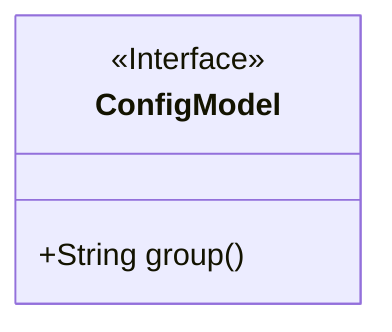
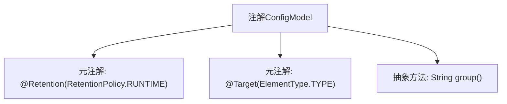

# 基础信息

|      |      |
|------|------|
| 名称 | ConfigModel |
| 编码语言 | .java |
| 代码路径 | WeFe/common/java/common-wefe/src/main/java/com/welab/wefe/common/wefe/dto/global_config/base/ConfigModel.java |
| 包名 | com.welab.wefe.common.wefe.dto.global_config.base |
| 依赖项 | ['java.lang.annotation.ElementType', 'java.lang.annotation.Retention', 'java.lang.annotation.RetentionPolicy', 'java.lang.annotation.Target'] |
| 概述说明 | Java注解ConfigModel，运行时保留，作用于类，需指定group字符串参数。 |

# 说明

这是一个名为ConfigModel的Java注解定义。该注解使用@Retention(RetentionPolicy.RUNTIME)指定在运行时保留，可通过反射读取。@Target(ElementType.TYPE)限定该注解只能用于类、接口或枚举类型。注解包含一个名为group的字符串类型成员变量，使用时必须提供该参数值。这个注解通常用于配置模型类的元数据标记。

# 类列表 Class Summary

| 名称   | 类型  | 说明 |
|-------|------|-------------|
| ConfigModel | annotation | 定义运行时保留的类注解ConfigModel，包含必填的group字符串属性。 |

## 类 ConfigModel

|      |      |
|------|------|
| 访问范围 | @Retention(RetentionPolicy.RUNTIME);@Target(ElementType.TYPE);public |
| 类型 | annotation |
| 名称 | ConfigModel |
| 说明 | 定义运行时保留的类注解ConfigModel，包含必填的group字符串属性。 |

### UML类图

这段代码定义了一个名为`ConfigModel`的运行时注解接口，该注解只能应用于类/接口类型。注解包含一个名为`group`的必填字符串属性。类图清晰地展示了这是一个标记为`<<Interface>>`的注解类型，其中包含一个公开的抽象方法`group()`，这对应于注解中定义的属性。这种结构常用于配置模型的元数据标记场景。

### 内部方法调用关系图

该流程图展示了Java注解`ConfigModel`的结构，包含两个元注解配置（运行时保留、类级目标）和一个抽象方法`group()`的声明。元注解控制注解的保留策略和作用目标，而抽象方法定义了注解使用时必须提供的属性。这种设计常用于框架配置模型标记场景。

### 字段列表 Field List

| 名称  | 类型  | 说明 |
|-------|-------|------|
| group | String | 获取当前字符串的分组名称。 |

### 方法列表

| 名称  | 类型  | 说明 |
|-------|-------|------|

