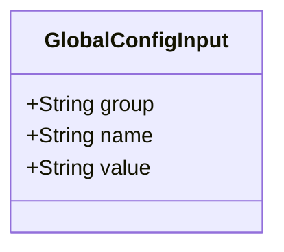
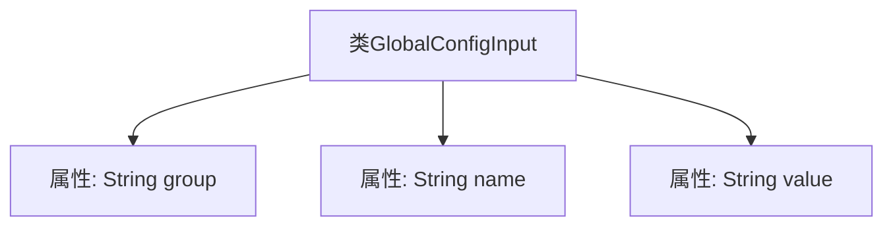

# 基础信息

|      |      |
|------|------|
| 名称 | GlobalConfigInput |
| 编码语言 | .java |
| 代码路径 | WeFe/common/java/common-wefe/src/main/java/com/welab/wefe/common/wefe/dto/global_config/base/GlobalConfigInput.java |
| 包名 | com.welab.wefe.common.wefe.dto.global_config.base |
| 依赖项 | [] |
| 概述说明 | GlobalConfigInput类包含三个字符串属性：group、name和value，用于配置项分组、名称和值。 |

# 说明

GlobalConfigInput类是一个用于存储全局配置信息的简单数据结构，包含三个公共字符串类型字段：group表示配置所属的分组，name表示配置项的名称，value存储具体的配置值。该结构体设计简洁，便于在不同模块间传递配置参数。

# 类列表 Class Summary

| 名称   | 类型  | 说明 |
|-------|------|-------------|
| GlobalConfigInput | class | GlobalConfigInput类包含三个字符串属性：group、name和value，用于配置项分组、名称和值。 |

## 类 GlobalConfigInput

|      |      |
|------|------|
| 访问范围 | public |
| 类型 | class |
| 名称 | GlobalConfigInput |
| 说明 | GlobalConfigInput类包含三个字符串属性：group、name和value，用于配置项分组、名称和值。 |

### UML类图

这段类图描述了一个简单的配置输入类GlobalConfigInput，包含三个公有字符串字段：group表示配置分组，name表示配置项名称，value存储配置值。该类作为数据传输对象（DTO）设计，无封装逻辑，直接暴露字段供外部读写，适用于需要快速访问配置信息的场景。

### 内部方法调用关系图

这段流程图描述了GlobalConfigInput类的结构，它是一个简单的数据载体类，包含三个公开的字符串类型属性：group、name和value。图中清晰展示了类与属性之间的从属关系，每个属性都直接关联到GlobalConfigInput类，没有方法或其他复杂逻辑。这种结构通常用于配置管理或数据传输场景，通过属性直接存储和访问数据。

### 字段列表 Field List

| 名称  | 类型  | 说明 |
|-------|-------|------|
| value | String | 公共字符串变量value。 |
| group | String | 定义了一个公共字符串变量group。 |
| name | String | 公开字符串变量name。 |

### 方法列表

| 名称  | 类型  | 说明 |
|-------|-------|------|

