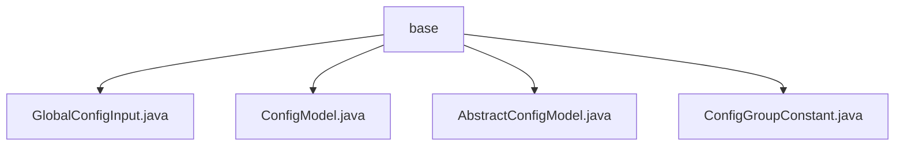

# 基础信息

|      |      |
|------|------|
| 名称 | base |
| 编码语言 | .java |
| 代码路径 | WeFe/common/java/common-wefe/src/main/java/com/welab/wefe/common/wefe/dto/global_config/base |
| 包名 | docs.common.java.common-wefe.src.main.java.com.welab.wefe.common.wefe.dto.global_config.base |
| 概述说明 | GlobalConfigInput类存储全局配置，含分组、名称和值字段。ConfigModel是运行时类注解，需指定分组。AbstractConfigModel通过反射管理配置类。ConfigGroupConstant定义各模块配置组常量。 |

# 说明

## 概述  
该模块实现全局配置的集中管理，核心职责包括配置项的结构化存储（如GlobalConfigInput）、模型类的元数据标记（如ConfigModel注解）以及分组管理（如AbstractConfigModel）。接口规范统一采用静态Map存储配置类，通过反射机制实现按组检索，例如getModelClass方法。关键数据结构包含带分组标识的配置项（类似键值对增强版）和配置组常量枚举（如ConfigGroupConstant）。外部依赖仅涉及Java反射机制。例如通过ConfigModel注解标记模型类，再通过AbstractConfigModel基类统一管理。

## 主要业务场景  
模块支持多业务线配置隔离，典型场景包括系统设置（如邮件服务器）、子系统参数（如网关配置）和云服务集成（如函数计算）。交互模式类似注册中心，配置类通过注解注册后即可按组查询。功能完整性体现在支持从基础配置项到复杂云服务的全场景覆盖，例如阿里云短信和Spark引擎配置。API类型包含常量引用（如ConfigGroupConstant）和类查询接口（如getModelClasses）。集成案例包括通过AbstractConfigModel自动发现所有带ConfigModel注解的配置类。

### 包内部结构视图

该流程图展示了WeFe项目中global_config/base目录下的文件结构关系。base作为父节点，包含4个子文件节点：GlobalConfigInput.java、ConfigModel.java、AbstractConfigModel.java和ConfigGroupConstant.java。这些文件都属于全局配置模块的基础DTO层，体现了配置模型的核心数据结构定义。

# 文件列表

| 名称   | 类型  | 说明 |
|-------|------|-------------|
| [GlobalConfigInput.java](GlobalConfigInput.md) | file | GlobalConfigInput类包含三个字符串属性：group、name和value，用于配置项分组、名称和值。 |
| [ConfigModel.java](ConfigModel.md) | file | Java注解ConfigModel，运行时保留，作用于类，需指定group字符串参数。 |
| [AbstractConfigModel.java](AbstractConfigModel.md) | file | 抽象类AbstractConfigModel继承AbstractCheckModel，通过反射收集带ConfigModel注解的类并存入静态Map，提供按组名或全部获取模型类的方法。 |
| [ConfigGroupConstant.java](ConfigGroupConstant.md) | file | ConfigGroupConstant类定义了系统设置、子系统、依赖服务、函数计算、深度学习和计算引擎的配置组常量。 |

