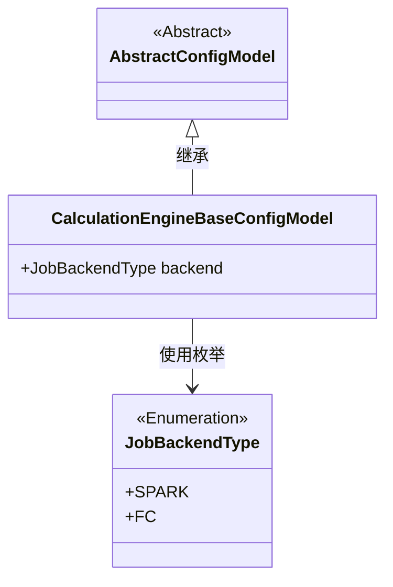
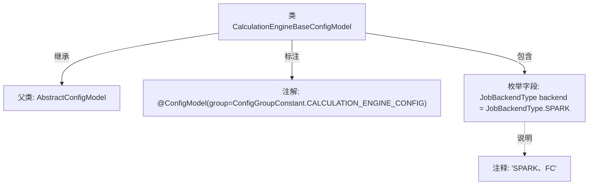

# 基础信息

|      |      |
|------|------|
| 名称 | CalculationEngineBaseConfigModel |
| 编码语言 | .java |
| 代码路径 | WeFe/common/java/common-wefe/src/main/java/com/welab/wefe/common/wefe/dto/global_config/calculation_engine/CalculationEngineBaseConfigModel.java |
| 包名 | com.welab.wefe.common.wefe.dto.global_config.calculation_engine |
| 依赖项 | ['com.welab.wefe.common.wefe.dto.global_config.base.AbstractConfigModel', 'com.welab.wefe.common.wefe.dto.global_config.base.ConfigGroupConstant', 'com.welab.wefe.common.wefe.dto.global_config.base.ConfigModel', 'com.welab.wefe.common.wefe.enums.JobBackendType'] |
| 概述说明 | 计算引擎基础配置类，使用SPARK作为默认后端类型。 |

# 说明

该内容定义了一个名为CalculationEngineBaseConfigModel的配置模型类，继承自AbstractConfigModel。通过@ConfigModel注解指定了配置组为CALCULATION_ENGINE_CONFIG。类中包含一个名为backend的公共属性，类型为JobBackendType枚举，默认值为SPARK，可选值包括SPARK和FC。该配置用于设置计算引擎的后端类型。

# 类列表 Class Summary

| 名称   | 类型  | 说明 |
|-------|------|-------------|
| CalculationEngineBaseConfigModel | class | 计算引擎基础配置类，使用SPARK作为默认后端类型。 |

## 类 CalculationEngineBaseConfigModel

|      |      |
|------|------|
| 访问范围 | @ConfigModel(group = ConfigGroupConstant.CALCULATION_ENGINE_CONFIG);public |
| 类型 | class |
| 名称 | CalculationEngineBaseConfigModel |
| 说明 | 计算引擎基础配置类，使用SPARK作为默认后端类型。 |

### UML类图

该类图展示了配置模型的核心结构。CalculationEngineBaseConfigModel继承自抽象类AbstractConfigModel，并包含一个JobBackendType枚举类型的backend字段，默认值为SPARK。JobBackendType枚举定义了SPARK和FC两种作业后端类型，用于标识计算引擎的运行时环境。整体设计符合配置模型的扩展需求，通过继承实现配置模型的共性功能。

### 内部方法调用关系图

该流程图展示了CalculationEngineBaseConfigModel类的核心结构，该类继承自AbstractConfigModel并带有@ConfigModel注解。主要包含一个JobBackendType类型的backend字段，默认值为SPARK，注释表明支持SPARK和FC两种后端类型。注解中指定了配置组为CALCULATION_ENGINE_CONFIG，体现了该配置类在计算引擎模块中的基础作用。

### 字段列表 Field List

| 名称  | 类型  | 说明 |
|-------|-------|------|
| backend = JobBackendType.SPARK | JobBackendType | 定义了一个名为backend的公共变量，类型为JobBackendType，初始值为SPARK。 |

### 方法列表

| 名称  | 类型  | 说明 |
|-------|-------|------|

