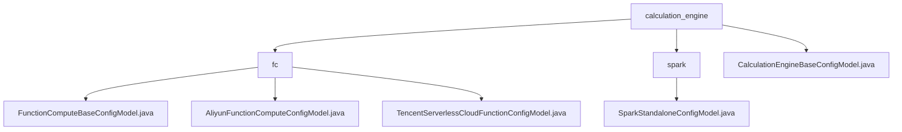

# 基础信息

|      |      |
|------|------|
| 名称 | calculation_engine |
| 编码语言 | .java |
| 代码路径 | WeFe/common/java/common-wefe/src/main/java/com/welab/wefe/common/wefe/dto/global_config/calculation_engine |
| 包名 | docs.common.java.common-wefe.src.main.java.com.welab.wefe.common.wefe.dto.global_config.calculation_engine |
| 概述说明 | 该模块是多云函数计算配置管理系统，统一管理阿里云/腾讯云资源。支持参数校验、默认值设置，依赖OSS/COS存储。关键配置包括账号凭证、区域信息等，标准化继承体系实现全链路管理。 |

# 说明

## 概述  
该模块是统一管理多云函数计算和计算引擎配置的核心系统，采用类似资源总线的设计模式。通过AbstractConfigModel基类规范接口，使用@Check/@ConfigModel注解实现校验和分组，关键数据结构涵盖云商凭证、资源配额（如内存/GPU）和区域信息等。外部依赖包括阿里云OSS、腾讯云COS及Spark计算框架。例如支持设置Driver内存（默认1g）和硬件加速选项（NONE/GPU）。

## 主要业务场景  
模块主要处理多云资源配置和计算引擎管理两类场景。前者实现跨云账号绑定（如阿里云VPC/腾讯云COS桶），后者通过JobBackendType枚举（SPARK/FC）切换计算后端。典型流程包含：初始化费用阈值→关联存储服务→配置计算参数（例如executorMemory）。所有操作均遵循版本化更新机制，覆盖从认证到资源分配的全生命周期。

### 包内部结构视图

该流程图展示了计算引擎配置的层级结构，顶层为calculation_engine目录，包含fc和spark两个子目录以及基础配置类。fc目录下包含三种不同的函数计算配置模型，spark目录下包含独立部署配置模型。整个结构清晰地反映了不同计算引擎的配置分类关系。

# 文件列表

| 名称   | 类型  | 说明 |
|-------|------|-------------|
| [CalculationEngineBaseConfigModel.java](CalculationEngineBaseConfigModel.md) | file | 计算引擎基础配置类，使用SPARK作为默认后端类型。 |
| [spark](spark/_module.md) | package | Spark独立配置类，含Driver内存、结果集大小、Executor内存及硬件加速设置，默认均为1g或NONE。 |
| [fc](fc/_module.md) | package | FunctionComputeBaseConfigModel类继承AbstractConfigModel，包含提供商、日费上限、月费上限。AliyunFunctionComputeConfigModel类包含账号、区域、密钥等阿里云配置。TencentServerlessCloudFunctionConfigModel类包含账号、区域、密钥等腾讯云配置。 |

