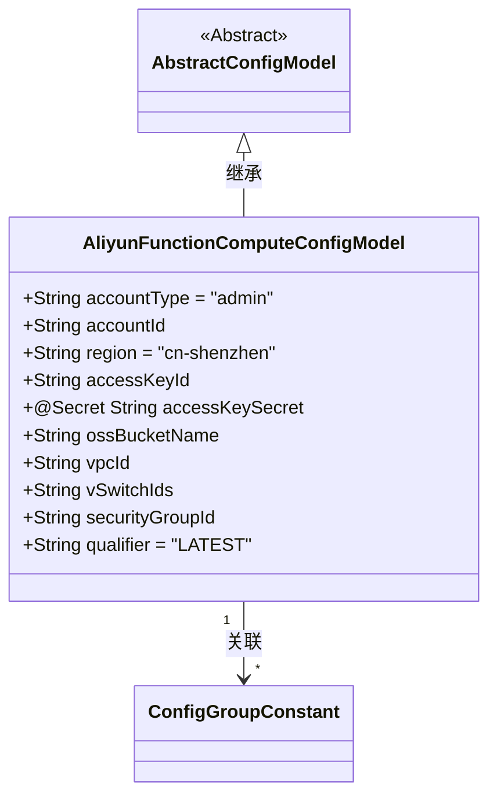

# 基础信息

|      |      |
|------|------|
| 名称 | AliyunFunctionComputeConfigModel |
| 编码语言 | .java |
| 代码路径 | WeFe/common/java/common-wefe/src/main/java/com/welab/wefe/common/wefe/dto/global_config/calculation_engine/fc/AliyunFunctionComputeConfigModel.java |
| 包名 | com.welab.wefe.common.wefe.dto.global_config.calculation_engine.fc |
| 依赖项 | ['com.welab.wefe.common.fieldvalidate.secret.MaskStrategy', 'com.welab.wefe.common.fieldvalidate.secret.Secret', 'com.welab.wefe.common.wefe.dto.global_config.base.AbstractConfigModel', 'com.welab.wefe.common.wefe.dto.global_config.base.ConfigGroupConstant', 'com.welab.wefe.common.wefe.dto.global_config.base.ConfigModel'] |
| 概述说明 | 阿里云函数计算配置类，包含账号类型、ID、区域、密钥、OSS桶名及可选VPC、交换机、安全组ID和版本号，默认区域为cn-shenzhen。 |

# 说明

该代码定义了一个名为AliyunFunctionComputeConfigModel的配置模型类，属于阿里云函数计算配置组。类中包含多个配置字段：账号类型默认为admin，账号ID，区域默认为cn-shenzhen，AccessKeyId和加密的AccessKeySecret，OSS的bucketName。可选字段包括专有网络vpc id、交换机v switch id、安全组secure group id。版本号默认为LATEST。所有字段均用于配置阿里云函数计算服务的相关参数。

# 类列表 Class Summary

| 名称   | 类型  | 说明 |
|-------|------|-------------|
| AliyunFunctionComputeConfigModel | class | 阿里云函数计算配置类，包含账号类型、ID、区域、密钥、OSS桶名及可选网络参数如VPC、交换机、安全组ID，版本默认LATEST。 |

## 类 AliyunFunctionComputeConfigModel

|      |      |
|------|------|
| 访问范围 | @ConfigModel(group = ConfigGroupConstant.ALIYUN_FC_CONFIG);public |
| 类型 | class |
| 名称 | AliyunFunctionComputeConfigModel |
| 说明 | 阿里云函数计算配置类，包含账号类型、ID、区域、密钥、OSS桶名及可选网络参数如VPC、交换机、安全组ID，版本默认LATEST。 |

### UML类图

该类图展示了阿里云函数计算配置模型的结构。AliyunFunctionComputeConfigModel继承自AbstractConfigModel，包含账户类型、区域、密钥等公有字段，其中accessKeySecret使用@Secret注解标记。该类通过@ConfigModel注解与ConfigGroupConstant.ALIYUN_FC_CONFIG配置组关联，提供函数计算服务所需的网络、安全组等可选配置项，默认版本号为LATEST。

### 内部方法调用关系图

```mermaid
graph TD
    A["类AliyunFunctionComputeConfigModel"]
    B["继承: AbstractConfigModel"]
    C["注解: @ConfigModel(group=ConfigGroupConstant.ALIYUN_FC_CONFIG)"]
    D["属性: String accountType = 'admin'"]
    E["属性: String accountId"]
    F["属性: String region = 'cn-shenzhen'"]
    G["属性: String accessKeyId"]
    H["属性: @Secret String accessKeySecret"]
    I["属性: String ossBucketName"]
    J["属性: String vpcId"]
    K["属性: String vSwitchIds"]
    L["属性: String securityGroupId"]
    M["属性: String qualifier = 'LATEST'"]

    A --> B
    A --> C
    A --> D
    A --> E
    A --> F
    A --> G
    A --> H
    A --> I
    A --> J
    A --> K
    A --> L
    A --> M
```

该流程图展示了AliyunFunctionComputeConfigModel类的结构，包括其继承关系、配置注解和所有属性字段。类继承自AbstractConfigModel，并带有@ConfigModel注解标记为阿里云函数计算配置组。属性包含账户信息、区域配置、访问密钥（含敏感字段加密注解）、OSS存储桶名称以及网络和安全相关可选参数，其中多个字段设有默认值。

### 字段列表 Field List

| 名称  | 类型  | 说明 |
|-------|-------|------|
| vpcId | String | 声明一个公共字符串变量vpcId。 |
| accessKeySecret | String | 代码定义了一个使用密码策略掩码的敏感字段accessKeySecret。 |
| accountType = "admin" | String | 定义了一个公共字符串变量accountType，其值为"admin"。 |
| qualifier = "LATEST" | String | 代码定义了一个公开字符串变量qualifier，初始值为"LATEST"。 |
| ossBucketName | String | 定义了一个公开的字符串变量ossBucketName，用于存储OSS存储桶名称。 |
| accessKeyId | String | 声明一个公共字符串变量accessKeyId。 |
| region = "cn-shenzhen" | String | 公共字符串变量region，值为"cn-shenzhen"，表示区域为深圳。 |
| accountId | String | 声明一个公开的字符串类型变量accountId。 |
| securityGroupId | String | 安全组ID字符串变量声明 |
| vSwitchIds | String | 字符串类型变量vSwitchIds，表示虚拟交换机ID列表。 |

### 方法列表

| 名称  | 类型  | 说明 |
|-------|-------|------|

