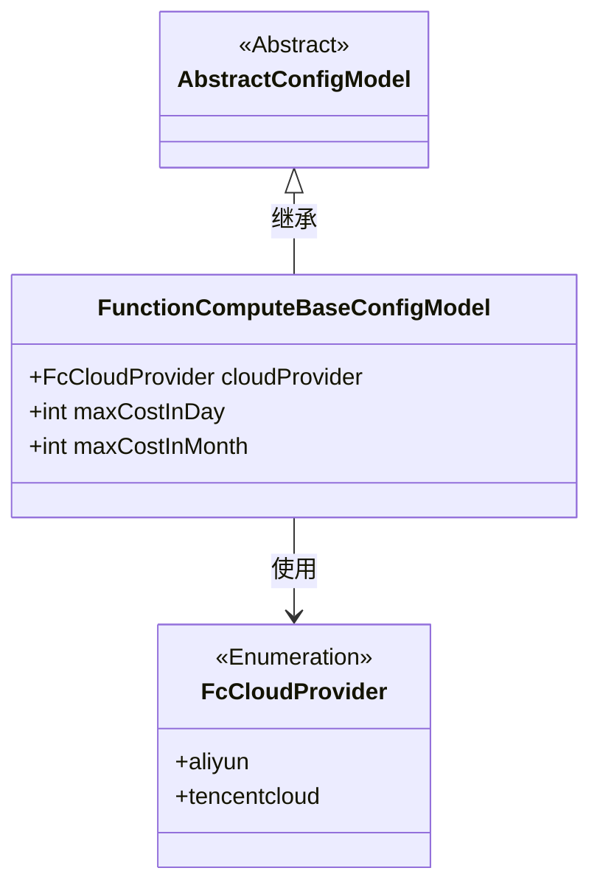
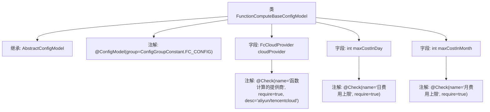

# 基础信息

|      |      |
|------|------|
| 名称 | FunctionComputeBaseConfigModel |
| 编码语言 | .java |
| 代码路径 | WeFe/common/java/common-wefe/src/main/java/com/welab/wefe/common/wefe/dto/global_config/calculation_engine/fc/FunctionComputeBaseConfigModel.java |
| 包名 | com.welab.wefe.common.wefe.dto.global_config.calculation_engine.fc |
| 依赖项 | ['com.welab.wefe.common.fieldvalidate.annotation.Check', 'com.welab.wefe.common.wefe.dto.global_config.base.AbstractConfigModel', 'com.welab.wefe.common.wefe.dto.global_config.base.ConfigGroupConstant', 'com.welab.wefe.common.wefe.dto.global_config.base.ConfigModel', 'com.welab.wefe.common.wefe.enums.FcCloudProvider'] |
| 概述说明 | 函数计算基础配置类，包含提供商（默认阿里云）、日费用上限（默认500）和月费用上限（默认1000）等必填配置项。 |

# 说明

这是一个名为FunctionComputeBaseConfigModel的配置模型类，属于FC_CONFIG配置组。它继承自AbstractConfigModel，包含三个关键配置项：函数计算的提供商（必填，默认值为aliyun，可选aliyun或tencentcloud）、日费用上限（必填，默认500）和月费用上限（必填，默认1000）。每个配置项都通过@Check注解进行了参数校验标记。

# 类列表 Class Summary

| 名称   | 类型  | 说明 |
|-------|------|-------------|
| FunctionComputeBaseConfigModel | class | 函数计算基础配置类，包含提供商（默认阿里云）、日费用上限（默认500）和月费用上限（默认1000）的必填配置项。 |

## 类 FunctionComputeBaseConfigModel

|      |      |
|------|------|
| 访问范围 | @ConfigModel(group = ConfigGroupConstant.FC_CONFIG);public |
| 类型 | class |
| 名称 | FunctionComputeBaseConfigModel |
| 说明 | 函数计算基础配置类，包含提供商（默认阿里云）、日费用上限（默认500）和月费用上限（默认1000）的必填配置项。 |

### UML类图

这段类图展示了FunctionComputeBaseConfigModel继承自AbstractConfigModel，并包含三个配置字段：cloudProvider（枚举类型，表示云服务提供商）、maxCostInDay（日费用上限）和maxCostInMonth（月费用上限）。其中cloudProvider字段通过注解限定了可选值为aliyun或tencentcloud，所有字段都标记为必填且带有业务描述。该配置模型通过@ConfigModel注解关联到特定的配置组，整体结构清晰体现了配置类的继承关系和字段约束。

### 内部方法调用关系图

该流程图展示了FunctionComputeBaseConfigModel类的结构，它继承自AbstractConfigModel类，并带有@ConfigModel注解。类中包含三个字段：cloudProvider、maxCostInDay和maxCostInMonth，每个字段都有对应的@Check注解进行配置验证。cloudProvider字段的注解包含更详细的描述信息，而其他两个字段的注解则相对简单，仅包含名称和必填标记。整个类用于配置函数计算的基础参数，包括云服务提供商选择和费用限制等。

### 字段列表 Field List

| 名称  | 类型  | 说明 |
|-------|-------|------|
| maxCostInDay = 500 | int | 代码定义了一个名为maxCostInDay的公共整型变量，默认值为500，并标注了必填校验注解，校验名称为"日费用上限"。 |
| cloudProvider = FcCloudProvider.aliyun | FcCloudProvider | 代码定义了一个名为"函数计算的提供商"的必填检查项，可选值为aliyun或tencentcloud，默认值为aliyun。 |
| maxCostInMonth = 1000 | int | 代码定义了一个名为maxCostInMonth的整型变量，初始值为1000，并通过@Check注解标记为必填项，检查名称为"月费用上限"。 |

### 方法列表

| 名称  | 类型  | 说明 |
|-------|-------|------|

