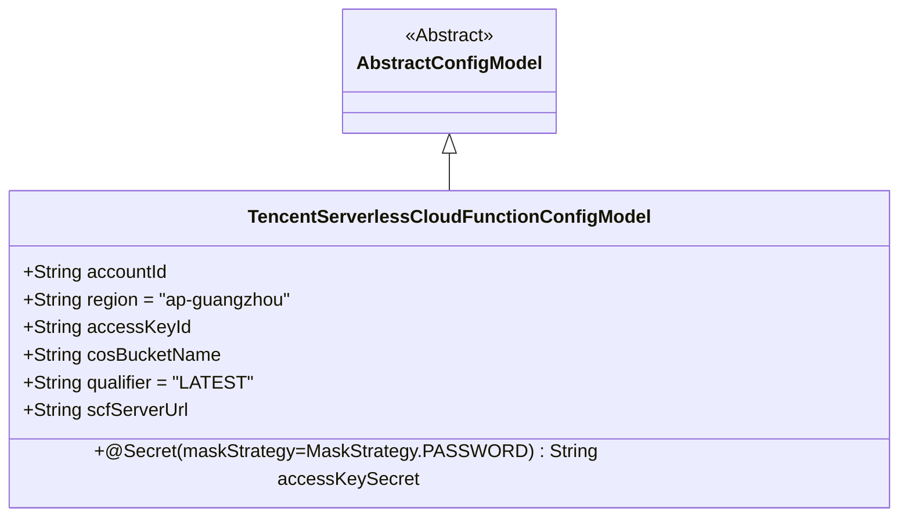
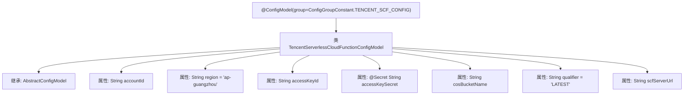

# 基础信息

|      |      |
|------|------|
| 名称 | TencentServerlessCloudFunctionConfigModel |
| 编码语言 | .java |
| 代码路径 | WeFe/common/java/common-wefe/src/main/java/com/welab/wefe/common/wefe/dto/global_config/calculation_engine/fc/TencentServerlessCloudFunctionConfigModel.java |
| 包名 | com.welab.wefe.common.wefe.dto.global_config.calculation_engine.fc |
| 依赖项 | ['com.welab.wefe.common.fieldvalidate.secret.MaskStrategy', 'com.welab.wefe.common.fieldvalidate.secret.Secret', 'com.welab.wefe.common.wefe.dto.global_config.base.AbstractConfigModel', 'com.welab.wefe.common.wefe.dto.global_config.base.ConfigGroupConstant', 'com.welab.wefe.common.wefe.dto.global_config.base.ConfigModel'] |
| 概述说明 | 腾讯云函数配置类，包含账号ID、区域、密钥、COS桶名、版本号和服务地址等字段。 |

# 说明

该内容定义了一个名为TencentServerlessCloudFunctionConfigModel的配置模型类，属于TENCENT_SCF_CONFIG组。类中包含多个配置字段：账号ID、默认区域为ap-guangzhou、AccessKeyId、使用密码掩码策略的AccessKeySecret、COS存储桶名称、默认版本号为LATEST的qualifier，以及SCF服务地址的URL。所有字段均为公共属性，继承自AbstractConfigModel基类。

# 类列表 Class Summary

| 名称   | 类型  | 说明 |
|-------|------|-------------|
| TencentServerlessCloudFunctionConfigModel | class | 腾讯云函数配置类，包含账号ID、区域、密钥、COS桶名、版本号和服务地址等字段。 |

## 类 TencentServerlessCloudFunctionConfigModel

|      |      |
|------|------|
| 访问范围 | @ConfigModel(group = ConfigGroupConstant.TENCENT_SCF_CONFIG);public |
| 类型 | class |
| 名称 | TencentServerlessCloudFunctionConfigModel |
| 说明 | 腾讯云函数配置类，包含账号ID、区域、密钥、COS桶名、版本号和服务地址等字段。 |

### UML类图

这段代码描述了一个腾讯云无服务器函数配置模型类，继承自抽象配置基类。该类包含账号ID、区域、访问密钥、COS存储桶名等公有字段，其中accessKeySecret字段使用密码掩码策略标注。region和qualifier字段带有默认值，scfServerUrl字段存储服务调用地址。该配置模型通过@ConfigModel注解标记为腾讯云SCF配置组。

### 内部方法调用关系图

该流程图展示了腾讯云函数配置类的结构，标注了类注解、继承关系和7个关键配置属性。其中包含区域默认值、密钥掩码注解等细节，完整呈现了配置模型的数据结构。所有属性均与腾讯云函数调用相关，包括账号凭证、服务地址等核心参数，通过继承抽象配置模型实现标准化管理。

### 字段列表 Field List

| 名称  | 类型  | 说明 |
|-------|-------|------|
| accessKeySecret | String | 声明一个密码掩码策略的密钥字符串变量accessKeySecret。 |
| region = "ap-guangzhou" | String | 腾讯云广州区域API参数，用于指定服务部署地区。 |
| cosBucketName | String | 声明一个公共字符串变量cosBucketName，用于存储COS存储桶名称。 |
| accessKeyId | String | 声明一个公共字符串变量accessKeyId。 |
| accountId | String | 声明一个公共字符串变量accountId。 |
| qualifier = "LATEST" | String | 字符串变量qualifier被初始化为"LATEST"。 |
| scfServerUrl | String | 声明一个公共字符串变量scfServerUrl。 |

### 方法列表

| 名称  | 类型  | 说明 |
|-------|-------|------|

