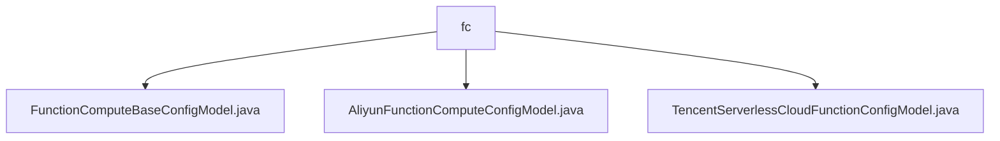

# 基础信息

|      |      |
|------|------|
| 名称 | fc |
| 编码语言 | .java |
| 代码路径 | WeFe/common/java/common-wefe/src/main/java/com/welab/wefe/common/wefe/dto/global_config/calculation_engine/fc |
| 包名 | docs.common.java.common-wefe.src.main.java.com.welab.wefe.common.wefe.dto.global_config.calculation_engine.fc |
| 概述说明 | FunctionComputeBaseConfigModel类继承AbstractConfigModel，包含提供商、日费上限、月费上限。AliyunFunctionComputeConfigModel类包含账号、区域、密钥等阿里云配置。TencentServerlessCloudFunctionConfigModel类包含账号、区域、密钥等腾讯云配置。 |

# 说明

## 概述  
该模块是函数计算服务的配置管理系统，核心职责是统一管理多云平台（阿里云/腾讯云）的无服务器计算资源配置。接口规范遵循抽象基类AbstractConfigModel的约束，通过@Check注解实现参数校验，支持必填项默认值设置。关键数据结构包括提供商类型、费用限额、账号凭证和区域信息等。外部依赖仅为阿里云OSS和腾讯云COS存储服务。例如阿里云配置需指定VPC网络，腾讯云则需配置SCF服务地址。

## 主要业务场景  
模块支持多云函数计算服务的初始化配置，类似云资源管理总线模式。典型流程包括：设置基础费用阈值、绑定云账号凭证、关联对象存储等。例如阿里云需配置专有网络，腾讯云需指定COS桶名。所有配置均通过继承体系实现标准化，支持LATEST版本自动更新。集成案例覆盖从账号认证到资源分配的全链路管理。

### 包内部结构视图

该流程图展示了WeFe项目中计算引擎配置模块的文件结构，根节点为fc文件夹，包含三个子文件：基础配置模型、阿里云函数计算配置模型和腾讯云无服务器云函数配置模型。这些文件均位于全局配置的计算引擎目录下，用于不同云服务商的无服务器计算功能配置。

# 文件列表

| 名称   | 类型  | 说明 |
|-------|------|-------------|
| [FunctionComputeBaseConfigModel.java](FunctionComputeBaseConfigModel.md) | file | 函数计算基础配置类，包含提供商（默认阿里云）、日费用上限（默认500）和月费用上限（默认1000）等必填配置项。 |
| [AliyunFunctionComputeConfigModel.java](AliyunFunctionComputeConfigModel.md) | file | 阿里云函数计算配置类，包含账号类型、ID、区域、密钥、OSS桶名及可选VPC、交换机、安全组ID和版本号，默认区域为cn-shenzhen。 |
| [TencentServerlessCloudFunctionConfigModel.java](TencentServerlessCloudFunctionConfigModel.md) | file | 腾讯云函数配置类，包含账号ID、区域、密钥、COS桶名、版本号和服务地址等字段。 |

