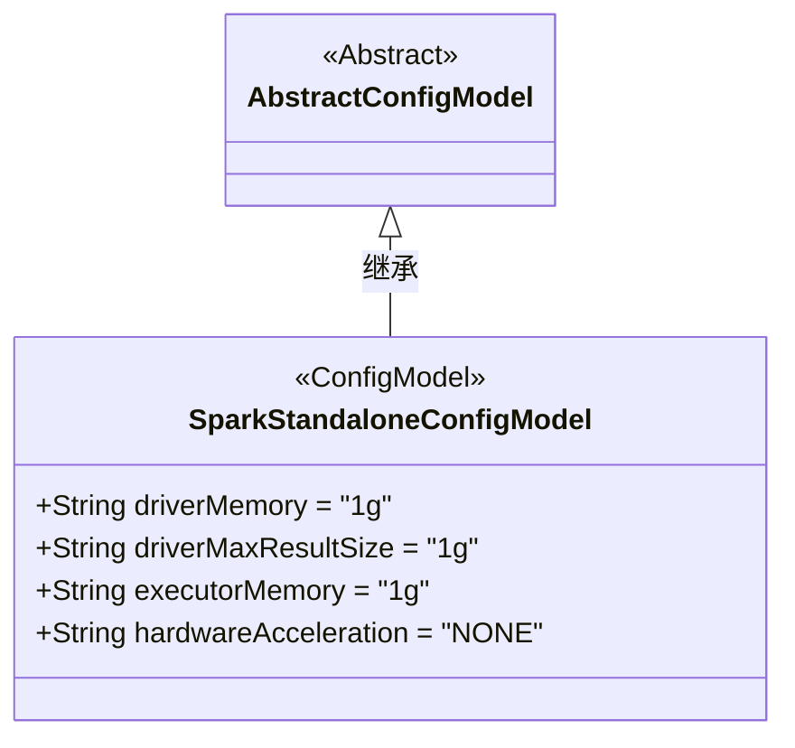
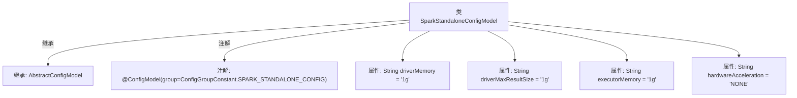

# 基础信息

|      |      |
|------|------|
| 名称 | SparkStandaloneConfigModel |
| 编码语言 | .java |
| 代码路径 | WeFe/common/java/common-wefe/src/main/java/com/welab/wefe/common/wefe/dto/global_config/calculation_engine/spark/SparkStandaloneConfigModel.java |
| 包名 | com.welab.wefe.common.wefe.dto.global_config.calculation_engine.spark |
| 依赖项 | ['com.welab.wefe.common.wefe.dto.global_config.base.AbstractConfigModel', 'com.welab.wefe.common.wefe.dto.global_config.base.ConfigGroupConstant', 'com.welab.wefe.common.wefe.dto.global_config.base.ConfigModel'] |
| 概述说明 | Spark独立配置类，含Driver内存、结果集大小、Executor内存及硬件加速设置，默认均为1g或NONE。 |

# 说明

SparkStandaloneConfigModel是一个配置模型类，属于SPARK_STANDALONE_CONFIG组。它定义了四个关键参数：driverMemory设置Driver内存，默认1g；driverMaxResultSize控制结果集最大大小，默认1g；executorMemory指定每个executor的内存，默认1g；hardwareAcceleration表示硬件加速选项，支持NONE和GPU两种枚举值，默认NONE。所有内存参数单位支持m和g。

# 类列表 Class Summary

| 名称   | 类型  | 说明 |
|-------|------|-------------|
| SparkStandaloneConfigModel | class | Spark独立配置类，含Driver内存、结果集大小、Executor内存及硬件加速配置项，默认值均为1g或NONE。 |

## 类 SparkStandaloneConfigModel

|      |      |
|------|------|
| 访问范围 | @ConfigModel(group = ConfigGroupConstant.SPARK_STANDALONE_CONFIG);public |
| 类型 | class |
| 名称 | SparkStandaloneConfigModel |
| 说明 | Spark独立配置类，含Driver内存、结果集大小、Executor内存及硬件加速配置项，默认值均为1g或NONE。 |

### UML类图

这段代码展示了一个Spark独立部署配置模型类，继承自抽象配置基类。SparkStandaloneConfigModel类包含四个公有字符串字段：driverMemory（驱动内存）、driverMaxResultSize（结果集最大大小）、executorMemory（执行器内存）和hardwareAcceleration（硬件加速类型），均带有默认值。通过@ConfigModel注解标记为Spark独立配置组，用于集中管理Spark集群的资源参数配置。

### 内部方法调用关系图

该流程图展示了SparkStandaloneConfigModel类的结构，该类继承自AbstractConfigModel并带有@ConfigModel注解。类中包含四个配置属性：driverMemory（驱动内存）、driverMaxResultSize（结果集最大大小）、executorMemory（执行器内存）和hardwareAcceleration（硬件加速），这些属性均设有默认值。该配置类用于定义Spark独立部署模式下的关键参数，通过内存单位（m/g）和加速类型（NONE/GPU）的枚举值进行配置管理。

### 字段列表 Field List

| 名称  | 类型  | 说明 |
|-------|-------|------|
| driverMemory = "1g" | String | Java变量driverMemory定义为字符串"1g"，表示驱动内存大小为1GB。 |
| driverMaxResultSize = "1g" | String | 参数driverMaxResultSize设置为1GB，限制驱动程序返回结果的最大大小。 |
| executorMemory = "1g" | String | 代码定义了一个字符串变量executorMemory，其值为"1g"，表示执行器内存大小为1GB。 |
| hardwareAcceleration = "NONE" | String | 变量hardwareAcceleration设置为"NONE"，表示禁用硬件加速。 |

### 方法列表

| 名称  | 类型  | 说明 |
|-------|-------|------|

