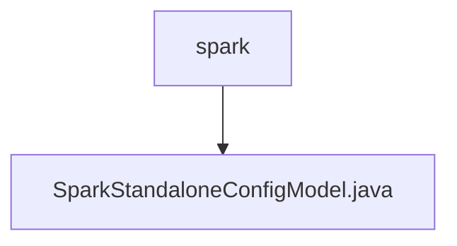

# 基础信息

|      |      |
|------|------|
| 名称 | spark |
| 编码语言 | .java |
| 代码路径 | WeFe/common/java/common-wefe/src/main/java/com/welab/wefe/common/wefe/dto/global_config/calculation_engine/spark |
| 包名 | docs.common.java.common-wefe.src.main.java.com.welab.wefe.common.wefe.dto.global_config.calculation_engine.spark |
| 概述说明 | Spark独立配置类，含Driver内存、结果集大小、Executor内存及硬件加速设置，默认均为1g或NONE。 |

# 说明

SparkStandaloneConfigModel是一个配置模型类，属于SPARK_STANDALONE_CONFIG组。它定义了四个关键参数：driverMemory设置Driver内存，默认1g；driverMaxResultSize控制结果集最大大小，默认1g；executorMemory指定每个executor的内存，默认1g；hardwareAcceleration表示硬件加速选项，支持NONE和GPU两种枚举值，默认NONE。所有内存参数单位支持m和g。

### 包内部结构视图

该流程图展示了Spark计算引擎配置的层级关系，顶层节点为spark目录，其下包含一个具体的配置模型文件SparkStandaloneConfigModel.java。这种结构体现了配置文件的组织方式，将特定功能的实现类放置在专属目录中，符合Java项目的标准包结构设计原则。

# 文件列表

| 名称   | 类型  | 说明 |
|-------|------|-------------|
| [SparkStandaloneConfigModel.java](SparkStandaloneConfigModel.md) | file | Spark独立配置类，含Driver内存、结果集大小、Executor内存及硬件加速设置，默认均为1g或NONE。 |

