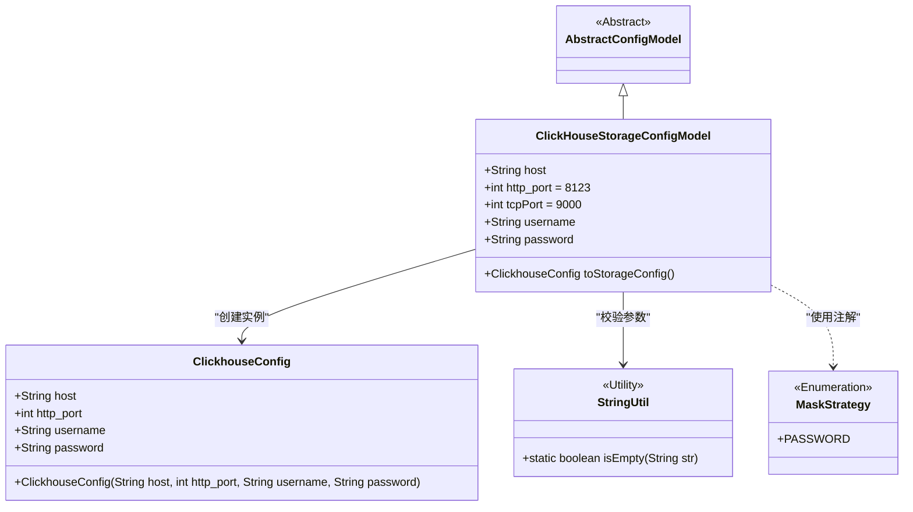
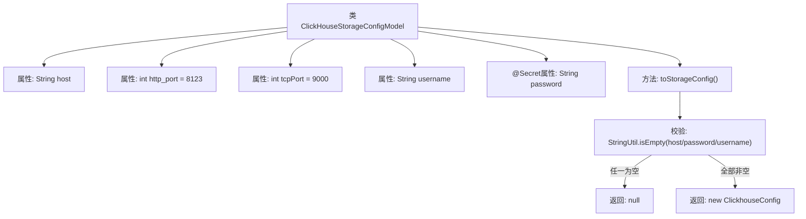

# 基础信息

|      |      |
|------|------|
| 名称 | ClickHouseStorageConfigModel |
| 编码语言 | .java |
| 代码路径 | WeFe/common/java/common-wefe/src/main/java/com/welab/wefe/common/wefe/dto/global_config/storage/ClickHouseStorageConfigModel.java |
| 包名 | com.welab.wefe.common.wefe.dto.global_config.storage |
| 依赖项 | ['com.welab.wefe.common.wefe.dto.global_config.base.AbstractConfigModel', 'com.welab.wefe.common.wefe.dto.global_config.base.ConfigGroupConstant', 'com.welab.wefe.common.wefe.dto.global_config.base.ConfigModel', 'com.welab.wefe.common.fieldvalidate.secret.MaskStrategy', 'com.welab.wefe.common.fieldvalidate.secret.Secret', 'com.welab.wefe.common.util.StringUtil', 'com.welab.wefe.common.wefe.dto.storage.ClickhouseConfig'] |
| 概述说明 | ClickHouse存储配置类，包含主机、端口、用户名和密码字段，提供转换为ClickhouseConfig的方法，缺失关键字段时返回null。 |

# 说明

这是一个ClickHouse存储配置模型类，属于CLICKHOUSE_STORAGE配置组。它继承自抽象配置模型类，包含主机地址、HTTP端口（默认8123）、TCP端口（默认9000）、用户名和密码字段。密码字段使用了密码掩码策略。该类提供了将配置转换为ClickhouseConfig对象的方法，转换前会检查必填字段是否为空。

# 类列表 Class Summary

| 名称   | 类型  | 说明 |
|-------|------|-------------|
| ClickHouseStorageConfigModel | class | ClickHouse存储配置类，包含主机、HTTP/TCP端口、用户名和密码字段，提供转换为ClickhouseConfig的方法，密码字段加密处理。 |

## 类 ClickHouseStorageConfigModel

|      |      |
|------|------|
| 访问范围 | @ConfigModel(group = ConfigGroupConstant.CLICKHOUSE_STORAGE);public |
| 类型 | class |
| 名称 | ClickHouseStorageConfigModel |
| 说明 | ClickHouse存储配置类，包含主机、HTTP/TCP端口、用户名和密码字段，提供转换为ClickhouseConfig的方法，密码字段加密处理。 |

### UML类图

这段类图展示了ClickHouse存储配置的核心结构。ClickHouseStorageConfigModel继承自AbstractConfigModel，包含主机、端口、认证信息等配置项，并通过toStorageConfig()方法转换为ClickhouseConfig对象。其中password字段使用@Secret注解进行脱敏处理，依赖StringUtil进行空值校验。整个设计实现了配置模型到存储配置的转换逻辑，同时遵循了配置安全性的最佳实践。

### 内部方法调用关系图

该流程图展示了ClickHouseStorageConfigModel类的结构和核心方法逻辑。类包含5个配置属性，其中password字段通过@Secret注解标记为敏感信息。toStorageConfig()方法会先校验host/username/password的非空性，任一为空则返回null，全部有效时才会构造ClickhouseConfig对象。流程清晰体现了配置转换时的安全校验逻辑。

### 字段列表 Field List

| 名称  | 类型  | 说明 |
|-------|-------|------|
| host | String | 声明一个公共字符串变量host。 |
| password | String | 代码定义了一个密码字段，使用@Secret注解并设置掩码策略为PASSWORD，表示该字段需保密处理。 |
| http_port = 8123 | int | HTTP服务端口设置为8123。 |
| tcpPort = 9000 | int | 定义了一个公共整型变量tcpPort，初始值为9000。 |
| username | String | 公共字符串变量username。 |

### 方法列表

| 名称  | 类型  | 说明 |
|-------|-------|------|
| toStorageConfig | ClickhouseConfig | 方法检查host、password、username是否为空，若为空返回null，否则返回包含这些字段的ClickhouseConfig对象。 |

