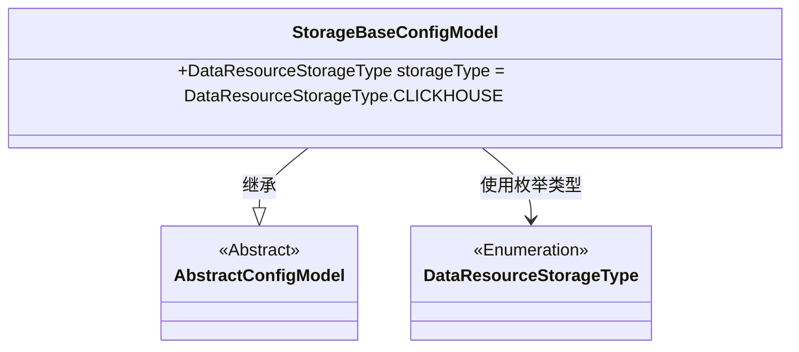
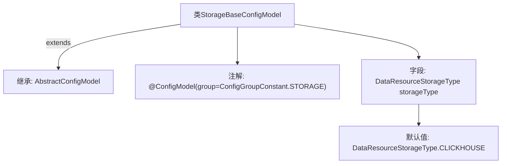

# 基础信息

|      |      |
|------|------|
| 名称 | StorageBaseConfigModel |
| 编码语言 | .java |
| 代码路径 | WeFe/common/java/common-wefe/src/main/java/com/welab/wefe/common/wefe/dto/global_config/storage/StorageBaseConfigModel.java |
| 包名 | com.welab.wefe.common.wefe.dto.global_config.storage |
| 依赖项 | ['com.welab.wefe.common.wefe.dto.global_config.base.AbstractConfigModel', 'com.welab.wefe.common.wefe.dto.global_config.base.ConfigGroupConstant', 'com.welab.wefe.common.wefe.dto.global_config.base.ConfigModel', 'com.welab.wefe.common.wefe.enums.DataResourceStorageType'] |
| 概述说明 | 存储配置类StorageBaseConfigModel，使用注解标记为存储组配置，默认存储类型为CLICKHOUSE。 |

# 说明

该内容描述了一个名为StorageBaseConfigModel的Java类，该类继承自AbstractConfigModel，并使用@ConfigModel注解标记为STORAGE配置组。该类定义了一个名为storageType的公共字段，其默认值为DataResourceStorageType枚举中的CLICKHOUSE类型。该配置模型用于存储相关的基础配置信息。

# 类列表 Class Summary

| 名称   | 类型  | 说明 |
|-------|------|-------------|
| StorageBaseConfigModel | class | 存储配置类StorageBaseConfigModel继承AbstractConfigModel，默认存储类型为CLICKHOUSE，属于STORAGE配置组。 |

## 类 StorageBaseConfigModel

|      |      |
|------|------|
| 访问范围 | @ConfigModel(group = ConfigGroupConstant.STORAGE);public |
| 类型 | class |
| 名称 | StorageBaseConfigModel |
| 说明 | 存储配置类StorageBaseConfigModel继承AbstractConfigModel，默认存储类型为CLICKHOUSE，属于STORAGE配置组。 |

### UML类图

这段类图展示了StorageBaseConfigModel继承自抽象类AbstractConfigModel，并包含一个DataResourceStorageType枚举类型的存储类型字段。StorageBaseConfigModel通过@ConfigModel注解标记为存储配置组，默认使用CLICKHOUSE作为存储类型。该设计实现了配置模型的扩展性，允许通过修改枚举值来切换不同的存储后端类型。

### 内部方法调用关系图

这段代码定义了一个名为StorageBaseConfigModel的配置模型类，继承自AbstractConfigModel基类。类上标注了@ConfigModel注解并指定了配置组为STORAGE，内部声明了一个storageType字段，默认值为CLICKHOUSE枚举类型。该结构表示一个存储相关的基础配置模型，通过注解实现配置分组管理，字段默认值表明系统默认采用ClickHouse作为存储引擎。

### 字段列表 Field List

| 名称  | 类型  | 说明 |
|-------|-------|------|
| storageType = DataResourceStorageType.CLICKHOUSE | DataResourceStorageType | 存储类型设置为CLICKHOUSE。 |

### 方法列表

| 名称  | 类型  | 说明 |
|-------|-------|------|

