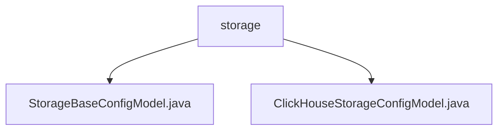

# 基础信息

|      |      |
|------|------|
| 名称 | storage |
| 编码语言 | .java |
| 代码路径 | WeFe/common/java/common-wefe/src/main/java/com/welab/wefe/common/wefe/dto/global_config/storage |
| 包名 | docs.common.java.common-wefe.src.main.java.com.welab.wefe.common.wefe.dto.global_config.storage |
| 概述说明 | StorageBaseConfigModel是继承AbstractConfigModel的STORAGE配置组Java类，含默认CLICKHOUSE的storageType字段。ClickHouseStorageConfigModel是其子类，属于CLICKHOUSE_STORAGE组，包含主机、端口、用户名密码等字段，提供转ClickhouseConfig方法并校验必填项。 |

# 说明

## 概述  
该模块核心职责是提供存储相关的配置管理功能，包含基础存储类型定义和ClickHouse专用配置。接口规范遵循抽象配置模型体系，使用@ConfigModel注解分组标识。关键数据结构包括StorageBaseConfigModel的基础类型字段和ClickHouseStorageConfigModel的连接参数（例如主机/端口/凭证）。外部依赖仅涉及DataResourceStorageType枚举。例如CLICKHOUSE类型默认值实现了存储类型的基础抽象。

## 主要业务场景  
模块支持存储配置的层级化管理，类似策略模式的结构设计。基础模型定义存储类型，ClickHouse子类扩展连接细节（例如HTTP/TCP双端口配置）。典型应用包含配置转换（如转ClickhouseConfig对象）和字段校验（如密码掩码和空值检查）。所有API类型均围绕配置持久化与转换，例如通过继承链实现多存储类型的统一管理。

### 包内部结构视图

该流程图展示了storage目录下的两个Java配置文件。StorageBaseConfigModel.java是基础存储配置模型，ClickHouseStorageConfigModel.java是ClickHouse数据库的特定存储配置模型，两者均属于全局配置模块中的存储配置部分，体现了配置模型的继承关系。

# 文件列表

| 名称   | 类型  | 说明 |
|-------|------|-------------|
| [StorageBaseConfigModel.java](StorageBaseConfigModel.md) | file | 存储配置类StorageBaseConfigModel，使用注解标记为存储组配置，默认存储类型为CLICKHOUSE。 |
| [ClickHouseStorageConfigModel.java](ClickHouseStorageConfigModel.md) | file | ClickHouse存储配置类，包含主机、端口、用户名和密码字段，提供转换为ClickhouseConfig的方法，缺失关键字段时返回null。 |

