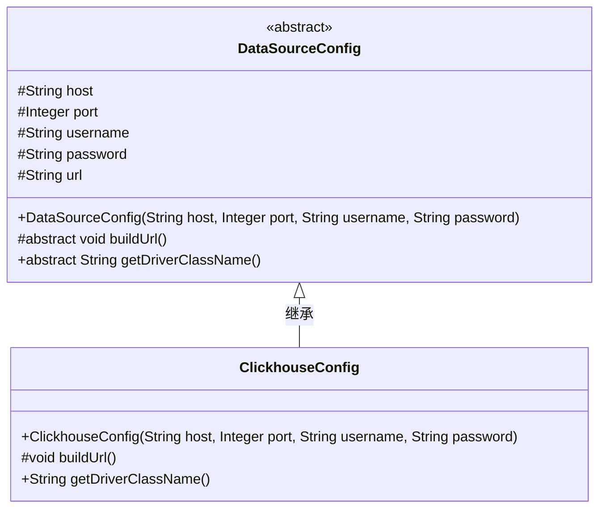
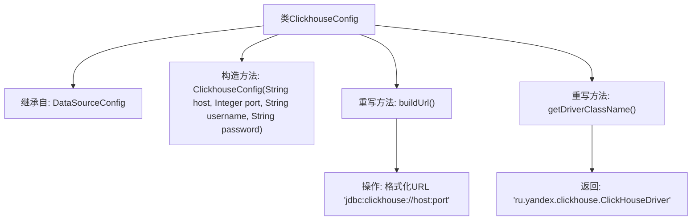

# 基础信息

|      |      |
|------|------|
| 名称 | ClickhouseConfig |
| 编码语言 | .java |
| 代码路径 | WeFe/common/java/common-wefe/src/main/java/com/welab/wefe/common/wefe/dto/storage/ClickhouseConfig.java |
| 包名 | com.welab.wefe.common.wefe.dto.storage |
| 依赖项 | [] |
| 概述说明 | ClickhouseConfig继承DataSourceConfig，通过构造函数初始化主机、端口、用户名和密码，构建ClickHouse的JDBC连接URL，并指定驱动类名。 |

# 说明

ClickhouseConfig类继承自DataSourceConfig，用于配置ClickHouse数据库连接。构造函数接收主机地址、端口号、用户名和密码，并调用父类构造函数初始化。重写buildUrl方法生成ClickHouse的JDBC连接URL，格式为jdbc:clickhouse://主机:端口。重写getDriverClassName方法返回ClickHouse的JDBC驱动类名ru.yandex.clickhouse.ClickHouseDriver。

# 类列表 Class Summary

| 名称   | 类型  | 说明 |
|-------|------|-------------|
| ClickhouseConfig | class | ClickhouseConfig继承DataSourceConfig，通过构造函数初始化数据库连接参数，重写buildUrl方法生成ClickHouse的JDBC连接URL，并指定驱动类名。 |

## 类 ClickhouseConfig

|      |      |
|------|------|
| 访问范围 | public |
| 类型 | class |
| 名称 | ClickhouseConfig |
| 说明 | ClickhouseConfig继承DataSourceConfig，通过构造函数初始化数据库连接参数，重写buildUrl方法生成ClickHouse的JDBC连接URL，并指定驱动类名。 |

### UML类图

这段类图展示了ClickhouseConfig类继承自抽象类DataSourceConfig的关系。DataSourceConfig定义了数据库连接的基本配置参数(host, port等)和抽象方法，ClickhouseConfig实现了这些抽象方法，专门用于配置ClickHouse数据库的连接。其中buildUrl()方法构建ClickHouse特定的JDBC连接字符串，getDriverClassName()返回ClickHouse的JDBC驱动类名。这种设计遵循了面向对象的继承原则，实现了数据库配置的通用性与特殊性的结合。

### 内部方法调用关系图

该流程图展示了ClickhouseConfig类的结构，它继承自DataSourceConfig类。主要包含构造方法和两个重写方法：buildUrl()用于构建ClickHouse数据库连接URL，getDriverClassName()返回ClickHouse的JDBC驱动类名。流程清晰地呈现了类继承关系和方法调用路径，突出了对父类方法的重写实现细节。

### 字段列表 Field List

| 名称  | 类型  | 说明 |
|-------|-------|------|

### 方法列表

| 名称  | 类型  | 说明 |
|-------|-------|------|
| buildUrl | void | 代码重写buildUrl方法，使用String.format拼接主机和端口生成ClickHouse数据库连接URL。 |
| getDriverClassName | String | Java方法重写，返回ClickHouse驱动类名"ru.yandex.clickhouse.ClickHouseDriver"。 |

