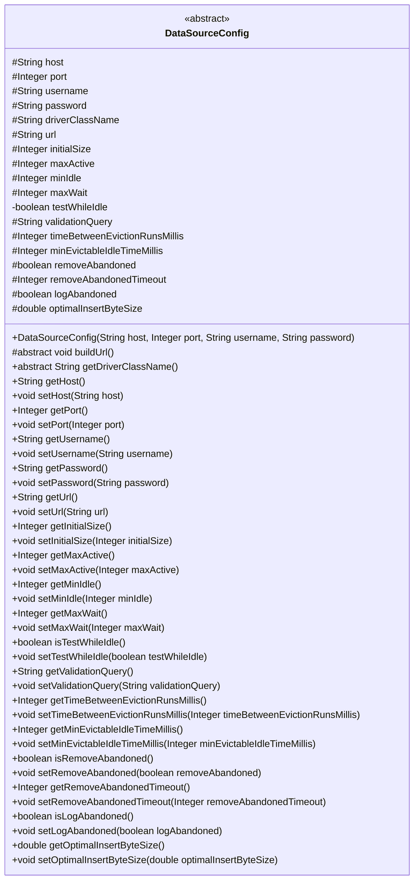
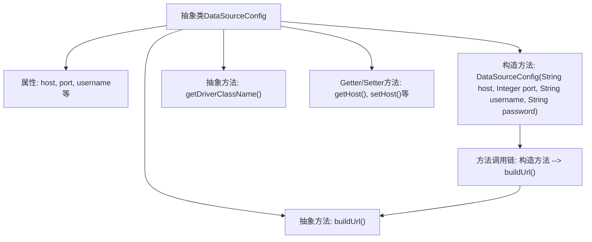

# 基础信息

|      |      |
|------|------|
| 名称 | DataSourceConfig |
| 编码语言 | .java |
| 代码路径 | WeFe/common/java/common-wefe/src/main/java/com/welab/wefe/common/wefe/dto/storage/DataSourceConfig.java |
| 包名 | com.welab.wefe.common.wefe.dto.storage |
| 依赖项 | ['org.springframework.util.Assert'] |
| 概述说明 | 抽象类DataSourceConfig定义了ClickHouse数据源配置，包含主机、端口、认证信息、连接池参数及URL构建方法，提供默认值和设置方法。 |

# 说明

这是一个抽象类DataSourceConfig，用于配置数据源连接参数。它包含主机地址、端口、用户名、密码等基本连接信息，以及连接池相关配置如初始大小、最大活跃数、最小空闲数等。类中还定义了连接验证、空闲检测、废弃连接处理等参数，并提供了最优批量插入字节大小的配置。该类通过构造函数强制要求非空参数，并包含抽象方法buildUrl和getDriverClassName供子类实现。所有字段都有对应的getter和setter方法。

# 类列表 Class Summary

| 名称   | 类型  | 说明 |
|-------|------|-------------|
| DataSourceConfig | class | 抽象类DataSourceConfig定义ClickHouse数据源配置，包含主机、端口、认证、连接池参数及批量插入优化设置，提供构造方法和抽象URL构建方法。 |

## 类 DataSourceConfig

|      |      |
|------|------|
| 访问范围 | public abstract |
| 类型 | class |
| 名称 | DataSourceConfig |
| 说明 | 抽象类DataSourceConfig定义ClickHouse数据源配置，包含主机、端口、认证、连接池参数及批量插入优化设置，提供构造方法和抽象URL构建方法。 |

### UML类图

这段代码定义了一个抽象类`DataSourceConfig`，用于配置数据源的连接参数和连接池参数。该类包含主机地址、端口、用户名、密码等基本连接信息，以及连接池大小、最大等待时间等连接池配置参数。其中`buildUrl()`和`getDriverClassName()`是抽象方法，需要子类实现。该类提供了丰富的getter和setter方法，允许灵活配置各个参数，适用于不同类型的数据库连接配置。

### 内部方法调用关系图

这段代码定义了一个抽象类DataSourceConfig，用于配置数据库连接参数。类中包含多个连接池相关属性（如host、port、连接数限制等）和对应的getter/setter方法。核心功能是通过构造方法初始化基本连接参数并调用抽象方法buildUrl()构建连接字符串，同时要求子类实现getDriverClassName()方法获取驱动类名。流程图展示了类结构、属性方法关系以及构造方法到buildUrl()的调用流程。

### 字段列表 Field List

| 名称  | 类型  | 说明 |
|-------|-------|------|
| initialSize = 1 | Integer | 初始大小设为1的受保护整型变量。 |
| removeAbandonedTimeout = 60 | Integer | 连接池移除空闲超时设为60秒。 |
| password | String | 声明一个受保护的字符串变量password。 |
| optimalInsertByteSize = 1 | double | 最优插入字节大小为1。 |
| maxActive = 50 | Integer | 最大活动连接数限制为50。 |
| validationQuery = "SELECT 1" | String | 数据库连接验证查询语句，用于检查连接有效性，默认执行"SELECT 1"。 |
| driverClassName | String | 声明受保护的字符串变量driverClassName，用于存储驱动类名。 |
| port = 8123 | Integer | 默认端口8123的受保护整型变量。 |
| host = "127.0.0.1" | String | 默认主机地址设为127.0.0.1。 |
| minIdle = 1 | Integer | 最小空闲连接数设为1。 |
| logAbandoned = true | boolean | 日志记录被遗弃对象功能已启用。 |
| maxWait = 60000 | Integer | 定义受保护整型变量maxWait，默认值60000毫秒。 |
| username | String | 声明一个受保护的字符串类型变量username。 |
| removeAbandoned = true | boolean | 设置移除废弃连接标志为真，表示允许自动回收未被正确关闭的连接。 |
| minEvictableIdleTimeMillis = 60000 | Integer | 配置项：最小空闲回收时间，默认60000毫秒（1分钟）。 |
| timeBetweenEvictionRunsMillis = 15000 | Integer | 连接池空闲连接检查间隔时间设置为15秒。 |
| testWhileIdle = false | boolean | 私有布尔变量testWhileIdle初始值为false，用于控制空闲时是否进行测试。 |
| url = "jdbc:clickhouse//127.0.0.1:8123" | String | JDBC连接ClickHouse的本地URL，地址为127.0.0.1，端口8123。 |

### 方法列表

| 名称  | 类型  | 说明 |
|-------|-------|------|
| setRemoveAbandonedTimeout | void | 设置废弃连接超时时间的方法，参数为整数类型。 |
| isRemoveAbandoned | boolean | 方法返回布尔值removeAbandoned，表示是否启用移除废弃对象功能。 |
| setPassword | void | 设置密码的方法，将输入参数赋值给类成员变量password。 |
| getInitialSize | Integer | 获取初始大小的整数值方法。 |
| getMaxActive | Integer | 获取最大活动数的方法，返回maxActive值。 |
| getUsername | String | 获取用户名字符串的方法。 |
| isLogAbandoned | boolean | 方法isLogAbandoned返回布尔值logAbandoned，表示是否记录废弃状态。 |
| setRemoveAbandoned | void | 设置是否移除被遗弃的对象，参数为布尔值。 |
| getMaxWait | Integer | 获取最大等待时间的整数值。 |
| getPort | Integer | 获取端口号的方法，返回整型数值。 |
| setHost | void | 这是一个Java方法，用于设置类的host属性。方法接收一个字符串参数host，并将其赋值给类的成员变量this.host。 |
| buildUrl | void | 抽象方法，用于构建URL。 |
| setTestWhileIdle | void | 设置空闲时是否测试连接的布尔值方法。 |
| isTestWhileIdle | boolean | 方法isTestWhileIdle返回布尔值testWhileIdle，用于检查空闲时是否测试。 |
| getMinIdle | Integer | 获取最小空闲连接数的方法，返回整型值minIdle。 |
| setTimeBetweenEvictionRunsMillis | void | 设置空闲对象回收线程的运行间隔时间（毫秒）。 |
| setMaxActive | void | 设置最大活动数的方法，参数为maxActive，赋值给类变量maxActive。 |
| setLogAbandoned | void | 设置是否记录废弃连接的布尔值参数。 |
| getHost | String | 获取主机地址的方法，返回字符串类型变量host。 |
| getPassword | String | 获取密码的方法，返回字符串类型密码。 |
| getRemoveAbandonedTimeout | Integer | 获取移除废弃连接的超时时间设置。 |
| setInitialSize | void | 设置初始大小的公共方法，参数为Integer类型。 |
| setValidationQuery | void | 设置验证查询语句的方法，用于更新类中的validationQuery变量。 |
| setMaxWait | void | 这是一个Java方法，用于设置maxWait属性的值。方法接收一个Integer参数，并将其赋值给类的maxWait成员变量。 |
| setPort | void | 设置端口号的方法，将参数port赋值给类的port属性。 |
| getUrl | String | 获取URL字符串的方法。 |
| getMinEvictableIdleTimeMillis | Integer | 获取最小可回收空闲时间毫秒数的方法。 |
| getValidationQuery | String | 获取验证查询字符串的方法，直接返回成员变量validationQuery的值。 |
| setOptimalInsertByteSize | void | 设置最优插入字节大小的方法，将输入值赋给类成员变量optimalInsertByteSize。 |
| setMinEvictableIdleTimeMillis | void | 设置对象最小可回收空闲时间（毫秒）。 |
| getTimeBetweenEvictionRunsMillis | Integer | 获取连接池空闲连接检测间隔时间（毫秒）。 |
| getDriverClassName | String | 抽象方法，返回驱动类名。 |
| setUrl | void | 设置URL地址的方法，将传入的字符串参数赋值给类的url变量。 |
| getOptimalInsertByteSize | double | 获取最优插入字节大小的方法。 |
| setUsername | void | 设置用户名的公共方法，将输入参数赋值给类的成员变量username。 |
| setMinIdle | void | 设置最小空闲连接数的方法，参数为整型minIdle。 |

