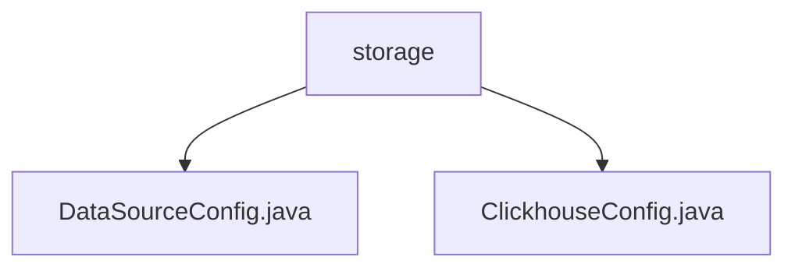

# 基础信息

|      |      |
|------|------|
| 名称 | storage |
| 编码语言 | .java |
| 代码路径 | WeFe/common/java/common-wefe/src/main/java/com/welab/wefe/common/wefe/dto/storage |
| 包名 | docs.common.java.common-wefe.src.main.java.com.welab.wefe.common.wefe.dto.storage |
| 概述说明 | 抽象类DataSourceConfig配置数据源连接参数，含连接池设置和验证功能。ClickhouseConfig继承该类，实现ClickHouse的JDBC连接URL和驱动类名。 |

# 说明

## 概述  
该模块核心职责是提供统一的数据源连接配置框架，支持多种数据库类型（如ClickHouse）的参数管理与URL构建。接口规范包括强制非空参数校验、连接池配置（例如初始大小/最大活跃数）以及驱动类名/URL生成的抽象方法。关键数据结构包含主机地址、端口等基础连接参数和连接池性能指标。外部依赖仅涉及JDBC驱动（例如ClickHouse的ru.yandex.clickhouse.ClickHouseDriver）。例如ClickhouseConfig通过继承实现ClickHouse特化的URL构建逻辑。

## 主要业务场景  
模块适用于需要多数据源管理的场景，通过抽象类统一基础配置，子类定制数据库差异（类似工厂模式）。典型流程为：初始化时强制校验参数→配置连接池→生成数据库特化URL。交互模式通过继承实现，例如ClickhouseConfig重写buildUrl返回jdbc:clickhouse://格式。完整功能覆盖从参数校验到驱动加载的全生命周期，支持批量插入优化等高级配置。

### 包内部结构视图

该流程图展示了WeFe项目中storage目录下的文件结构关系。storage作为父节点，包含两个子节点：DataSourceConfig.java和ClickhouseConfig.java配置类文件。这两个Java文件都属于数据存储相关的配置类，位于相同的包路径层级下，体现了项目中对不同数据库类型配置的模块化设计。

# 文件列表

| 名称   | 类型  | 说明 |
|-------|------|-------------|
| [DataSourceConfig.java](DataSourceConfig.md) | file | 抽象类DataSourceConfig定义了ClickHouse数据源配置，包含主机、端口、认证信息、连接池参数及URL构建方法，提供默认值和设置方法。 |
| [ClickhouseConfig.java](ClickhouseConfig.md) | file | ClickhouseConfig继承DataSourceConfig，通过构造函数初始化主机、端口、用户名和密码，构建ClickHouse的JDBC连接URL，并指定驱动类名。 |

