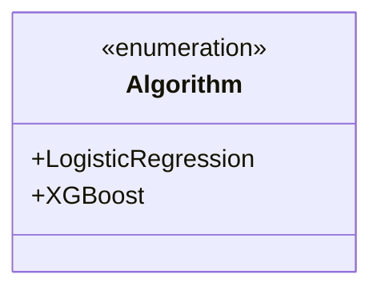
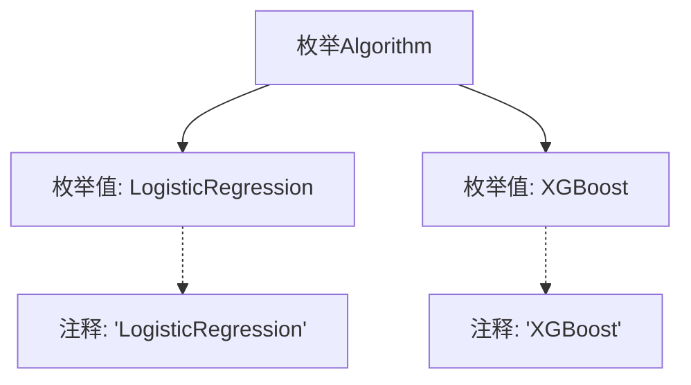

# 基础信息

|      |      |
|------|------|
| 名称 | Algorithm |
| 编码语言 | .java |
| 代码路径 | WeFe/common/java/common-wefe/src/main/java/com/welab/wefe/common/wefe/enums/Algorithm.java |
| 包名 | com.welab.wefe.common.wefe.enums |
| 依赖项 | [] |
| 概述说明 | 定义了一个枚举类型Algorithm，包含两种算法：LogisticRegression和XGBoost。 |

# 说明

该内容定义了一个名为Algorithm的公共枚举类型，包含两个枚举值：LogisticRegression和XGBoost。这两个枚举值分别代表逻辑回归算法和XGBoost算法，并通过注释对每个算法进行了简要说明。枚举类型通常用于表示一组固定的相关常量，此处用于表示不同的机器学习算法类型。

# 类列表 Class Summary

| 名称   | 类型  | 说明 |
|-------|------|-------------|
| Algorithm | enum | 枚举Algorithm包含两种算法：LogisticRegression和XGBoost。 |

## 类 Algorithm

|      |      |
|------|------|
| 访问范围 | public |
| 类型 | enum |
| 名称 | Algorithm |
| 说明 | 枚举Algorithm包含两种算法：LogisticRegression和XGBoost。 |

### UML类图

这段代码定义了一个名为Algorithm的枚举类型，包含两个枚举常量：LogisticRegression和XGBoost。枚举类型用于表示一组固定的常量值，这里可能用于指定机器学习算法的类型。LogisticRegression代表逻辑回归算法，XGBoost代表梯度提升决策树算法。枚举类型的使用可以增强代码的可读性和类型安全性，避免使用魔法字符串或数字来表示算法类型。

### 内部方法调用关系图

该流程图展示了Algorithm枚举的结构，包含两个枚举值LogisticRegression和XGBoost，每个枚举值都有对应的注释说明。枚举作为一种特殊的类，用于定义一组固定的常量，这里用于表示两种不同的算法类型。流程图清晰地呈现了枚举的定义方式及其内部元素的关联关系，注释与枚举值之间用虚线连接表示说明性关系。

### 字段列表 Field List

| 名称  | 类型  | 说明 |
|-------|-------|------|

### 方法列表

| 名称  | 类型  | 说明 |
|-------|-------|------|

