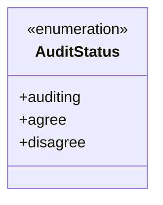
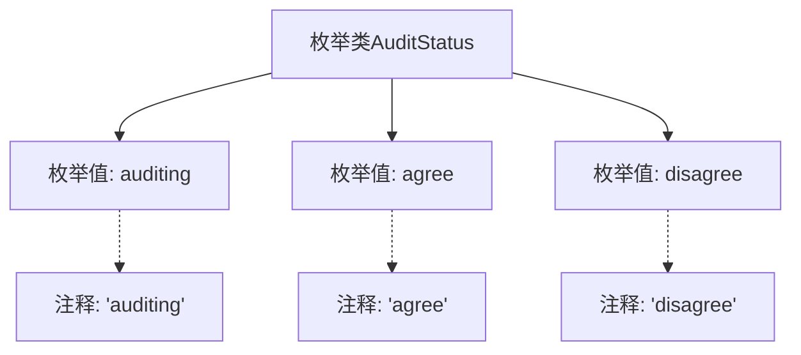

# 基础信息

|      |      |
|------|------|
| 名称 | AuditStatus |
| 编码语言 | .java |
| 代码路径 | WeFe/common/java/common-wefe/src/main/java/com/welab/wefe/common/wefe/enums/AuditStatus.java |
| 包名 | com.welab.wefe.common.wefe.enums |
| 依赖项 | [] |
| 概述说明 | 枚举AuditStatus定义三种状态：审核中auditing、同意agree、拒绝disagree。 |

# 说明

该内容定义了一个名为AuditStatus的枚举类型，包含三个枚举值：auditing表示审核中，agree表示同意，disagree表示不同意。每个枚举值都有对应的注释说明其含义。该枚举用于表示审核状态的不同阶段或结果。

# 类列表 Class Summary

| 名称   | 类型  | 说明 |
|-------|------|-------------|
| AuditStatus | enum | 枚举AuditStatus定义三种状态：auditing审核中，agree同意，disagree拒绝。 |

## 类 AuditStatus

|      |      |
|------|------|
| 访问范围 | public |
| 类型 | enum |
| 名称 | AuditStatus |
| 说明 | 枚举AuditStatus定义三种状态：auditing审核中，agree同意，disagree拒绝。 |

### UML类图

这段代码定义了一个名为`AuditStatus`的枚举类型，包含三个枚举常量：`auditing`（审核中）、`agree`（同意）和`disagree`（不同意）。枚举用于表示固定的状态集合，每个状态通过Javadoc注释说明了其含义。该枚举适用于需要明确区分审核流程状态的场景，如工作流审批、内容审核等系统，通过类型安全的方式替代魔法字符串，提升代码可读性和可维护性。

### 内部方法调用关系图

该流程图展示了AuditStatus枚举类的结构，包含三个枚举值（auditing、agree、disagree）及其对应的注释说明。每个枚举值通过虚线连接关联到其Javadoc注释，清晰地呈现了状态枚举的定义方式和文档化规范。这种设计常用于表示具有固定选项的业务状态，例如审批流程中的审核状态。

### 字段列表 Field List

| 名称  | 类型  | 说明 |
|-------|-------|------|

### 方法列表

| 名称  | 类型  | 说明 |
|-------|-------|------|

