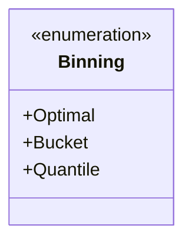
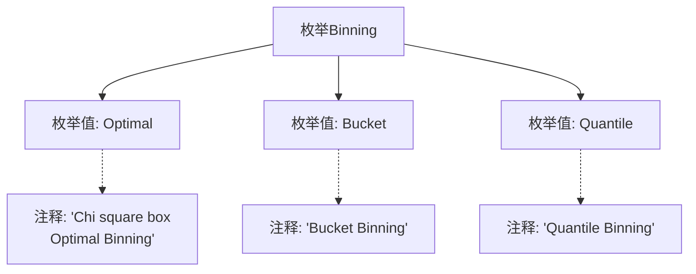

# 基础信息

|      |      |
|------|------|
| 名称 | Binning |
| 编码语言 | .java |
| 代码路径 | WeFe/common/java/common-wefe/src/main/java/com/welab/wefe/common/wefe/enums/Binning.java |
| 包名 | com.welab.wefe.common.wefe.enums |
| 依赖项 | [] |
| 概述说明 | Binning枚举包含三种分箱方法：Optimal（卡方最优分箱）、Bucket（等宽分箱）、Quantile（等频分箱）。 |

# 说明

该内容定义了一个名为Binning的枚举类型，包含三种分箱方法：Optimal（卡方箱，最优分箱）、Bucket（桶分箱）和Quantile（分位数分箱）。每种方法通过注释简要说明其特点。

# 类列表 Class Summary

| 名称   | 类型  | 说明 |
|-------|------|-------------|
| Binning | enum | Binning枚举定义三种分箱方法：Optimal（卡方最优分箱）、Bucket（等宽分箱）、Quantile（分位数分箱）。 |

## 类 Binning

|      |      |
|------|------|
| 访问范围 | public |
| 类型 | enum |
| 名称 | Binning |
| 说明 | Binning枚举定义三种分箱方法：Optimal（卡方最优分箱）、Bucket（等宽分箱）、Quantile（分位数分箱）。 |

### UML类图

这段代码定义了一个名为Binning的枚举类型，包含三种不同的分箱方法：Optimal（卡方最优分箱）、Bucket（等宽分箱）和Quantile（等频分箱）。枚举类型在类图中用<<enumeration>>标记，列出了所有枚举常量作为公有属性。该设计简洁地表示了数据分箱的三种策略选择，适用于特征工程中连续变量离散化的场景。

### 内部方法调用关系图

该流程图展示了Binning枚举的结构，包含三个枚举值(Optimal/Bucket/Quantile)及其对应的注释说明。Optimal值有详细的多行注释描述其统计特性，其他两个枚举值也有单行注释说明其分箱策略。图形清晰地呈现了枚举定义与文档注释的关联关系，体现了代码的自文档化特征。

### 字段列表 Field List

| 名称  | 类型  | 说明 |
|-------|-------|------|

### 方法列表

| 名称  | 类型  | 说明 |
|-------|-------|------|

