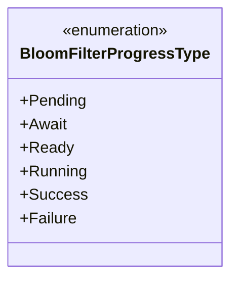
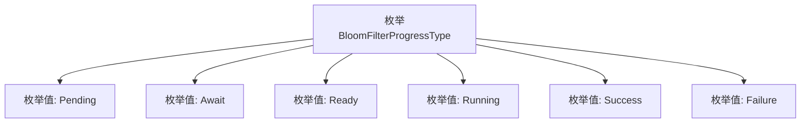

# 基础信息

|      |      |
|------|------|
| 名称 | BloomFilterProgressType |
| 编码语言 | .java |
| 代码路径 | WeFe/common/java/common-wefe/src/main/java/com/welab/wefe/common/wefe/enums/BloomFilterProgressType.java |
| 包名 | com.welab.wefe.common.wefe.enums |
| 依赖项 | [] |
| 概述说明 | 枚举BloomFilterProgressType定义了布隆过滤器的进度状态：待处理、等待、就绪、运行中、成功、失败。 |

# 说明

该枚举类型定义了布隆过滤器处理过程的不同状态，包含六个具体状态值：Pending表示待处理初始状态；Await表示等待触发条件；Ready表示准备就绪可执行；Running表示正在处理中；Success表示成功完成；Failure表示处理失败。这些状态完整覆盖了布隆过滤器生命周期中的关键节点。

# 类列表 Class Summary

| 名称   | 类型  | 说明 |
|-------|------|-------------|
| BloomFilterProgressType | enum | BloomFilterProgressType枚举定义了布隆过滤器的进度状态：待处理、等待、就绪、运行中、成功、失败。 |

## 类 BloomFilterProgressType

|      |      |
|------|------|
| 访问范围 | public |
| 类型 | enum |
| 名称 | BloomFilterProgressType |
| 说明 | BloomFilterProgressType枚举定义了布隆过滤器的进度状态：待处理、等待、就绪、运行中、成功、失败。 |

### UML类图

这段代码定义了一个名为`BloomFilterProgressType`的枚举类，包含6个枚举常量：Pending、Await、Ready、Running、Success和Failure。该枚举用于表示布隆过滤器在处理过程中的不同状态，从初始待处理（Pending）到最终成功（Success）或失败（Failure）的完整生命周期。每个枚举常量代表一个特定阶段，适用于状态跟踪或流程控制场景。

### 内部方法调用关系图

该流程图展示了BloomFilterProgressType枚举的结构，包含6个枚举值：Pending、Await、Ready、Running、Success和Failure。每个枚举值通过箭头从主枚举类延伸出来，表示它们是该枚举类型的成员。这种结构常用于表示状态机的不同阶段或操作的进度状态，适用于需要明确区分离散状态的场景。

### 字段列表 Field List

| 名称  | 类型  | 说明 |
|-------|-------|------|

### 方法列表

| 名称  | 类型  | 说明 |
|-------|-------|------|

