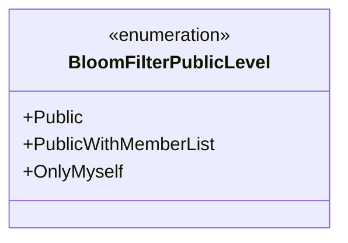
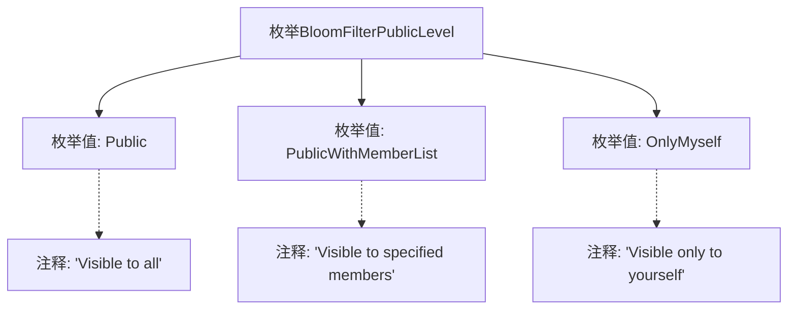

# 基础信息

|      |      |
|------|------|
| 名称 | BloomFilterPublicLevel |
| 编码语言 | .java |
| 代码路径 | WeFe/common/java/common-wefe/src/main/java/com/welab/wefe/common/wefe/enums/BloomFilterPublicLevel.java |
| 包名 | com.welab.wefe.common.wefe.enums |
| 依赖项 | [] |
| 概述说明 | BloomFilterPublicLevel枚举定义了三种公开级别：所有人可见、指定成员可见和仅自己可见。 |

# 说明

该内容定义了一个名为BloomFilterPublicLevel的枚举类型，包含三个枚举值。Public表示对所有用户可见，PublicWithMemberList表示仅对指定成员可见，OnlyMyself表示仅对用户自己可见。每个枚举值都有对应的注释说明其可见性范围。

# 类列表 Class Summary

| 名称   | 类型  | 说明 |
|-------|------|-------------|
| BloomFilterPublicLevel | enum | BloomFilterPublicLevel枚举定义三种可见性级别：公开、指定成员可见、仅自己可见。 |

## 类 BloomFilterPublicLevel

|      |      |
|------|------|
| 访问范围 | public |
| 类型 | enum |
| 名称 | BloomFilterPublicLevel |
| 说明 | BloomFilterPublicLevel枚举定义三种可见性级别：公开、指定成员可见、仅自己可见。 |

### UML类图

该枚举类定义了三种布隆过滤器的公开级别：Public（完全公开）、PublicWithMemberList（对指定成员公开）和OnlyMyself（仅自己可见）。每个枚举值都通过JavaDoc注释说明了其具体含义，用于控制布隆过滤器数据的访问权限范围。这种设计常用于需要精细化权限管理的场景，如社交网络或协作系统的隐私控制模块。

### 内部方法调用关系图

该流程图展示了BloomFilterPublicLevel枚举的结构，包含三个枚举值(Public、PublicWithMemberList、OnlyMyself)及其对应的注释说明。Public表示对所有用户可见，PublicWithMemberList表示对指定成员可见，OnlyMyself表示仅自己可见。通过箭头连接清晰地表现了枚举类与各枚举值之间的包含关系，以及每个枚举值与其文档注释的关联关系。

### 字段列表 Field List

| 名称  | 类型  | 说明 |
|-------|-------|------|

### 方法列表

| 名称  | 类型  | 说明 |
|-------|-------|------|

