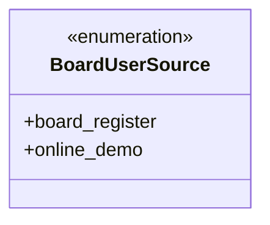
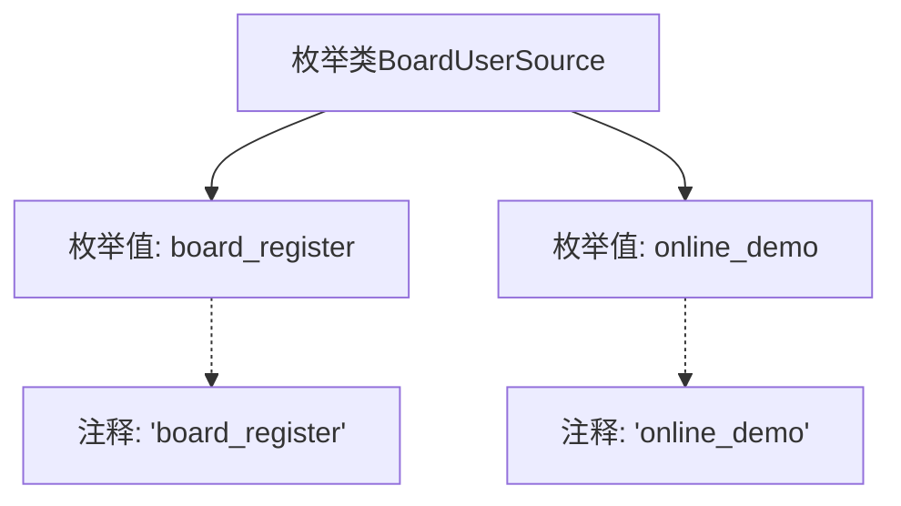

# 基础信息

|      |      |
|------|------|
| 名称 | BoardUserSource |
| 编码语言 | .java |
| 代码路径 | WeFe/common/java/common-wefe/src/main/java/com/welab/wefe/common/wefe/enums/BoardUserSource.java |
| 包名 | com.welab.wefe.common.wefe.enums |
| 依赖项 | [] |
| 概述说明 | BoardUserSource枚举定义用户来源：board_register（注册用户）和online_demo（在线演示用户）。 |

# 说明

BoardUserSource是一个枚举类型，包含两个成员：board_register和online_demo。board_register表示用户来源为看板注册，online_demo表示用户来源为在线演示。该枚举用于标识用户的不同来源渠道。

# 类列表 Class Summary

| 名称   | 类型  | 说明 |
|-------|------|-------------|
| BoardUserSource | enum | BoardUserSource枚举定义用户来源：board_register（注册用户）和online_demo（在线演示用户）。 |

## 类 BoardUserSource

|      |      |
|------|------|
| 访问范围 | public |
| 类型 | enum |
| 名称 | BoardUserSource |
| 说明 | BoardUserSource枚举定义用户来源：board_register（注册用户）和online_demo（在线演示用户）。 |

### UML类图

这段代码定义了一个名为BoardUserSource的枚举类型，包含两个枚举常量：board_register和online_demo。枚举类型用于表示一组固定的常量值，这里可能用于标识用户来源的不同渠道。board_register表示用户通过看板注册方式加入，online_demo表示用户通过在线演示方式访问系统。枚举类型在类图中用<<enumeration>>标记，清晰地展示了其特殊类型特征和可选的有限值集合。

### 内部方法调用关系图

这段流程图展示了BoardUserSource枚举类的结构，包含两个枚举值board_register和online_demo，每个枚举值都带有对应的注释说明。该枚举类可能用于区分用户来源，board_register表示通过看板注册的用户，online_demo表示在线演示用户。这种设计常用于系统用户来源的标识和分类，通过枚举类型确保类型安全性和代码可读性。

### 字段列表 Field List

| 名称  | 类型  | 说明 |
|-------|-------|------|

### 方法列表

| 名称  | 类型  | 说明 |
|-------|-------|------|

