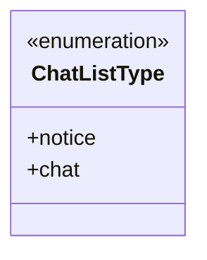
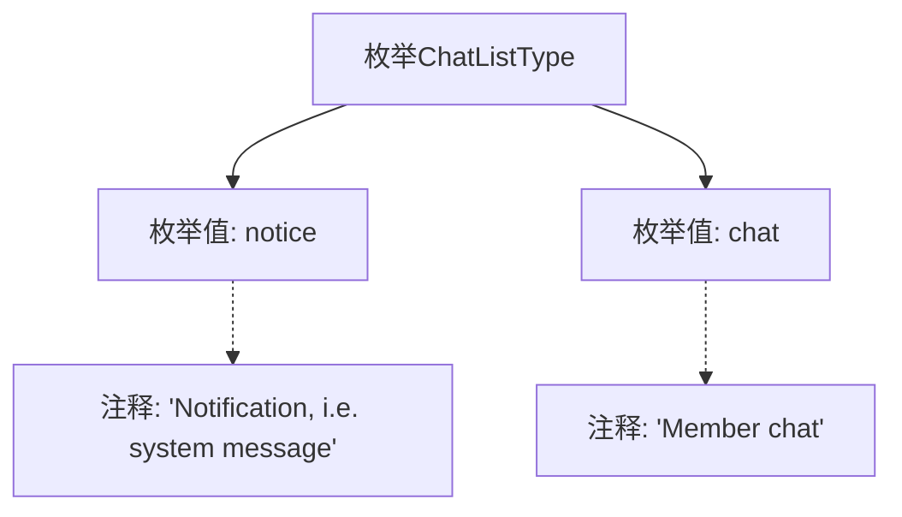

# 基础信息

|      |      |
|------|------|
| 名称 | ChatListType |
| 编码语言 | .java |
| 代码路径 | WeFe/common/java/common-wefe/src/main/java/com/welab/wefe/common/wefe/enums/ChatListType.java |
| 包名 | com.welab.wefe.common.wefe.enums |
| 依赖项 | [] |
| 概述说明 | 聊天列表类型枚举：notice表示系统通知消息，chat表示成员聊天消息。 |

# 说明

该内容定义了一个名为ChatListType的枚举类型，包含两个枚举值：notice和chat。notice表示系统通知或消息，chat表示成员聊天。枚举通过注释说明了每个值的用途。

# 类列表 Class Summary

| 名称   | 类型  | 说明 |
|-------|------|-------------|
| ChatListType | enum | 聊天列表类型枚举：notice表示系统通知消息，chat表示成员聊天消息。 |

## 类 ChatListType

|      |      |
|------|------|
| 访问范围 | public |
| 类型 | enum |
| 名称 | ChatListType |
| 说明 | 聊天列表类型枚举：notice表示系统通知消息，chat表示成员聊天消息。 |

### UML类图

这段代码定义了一个名为ChatListType的枚举类型，包含两个枚举常量：notice和chat。notice表示系统通知消息，chat表示普通成员聊天消息。枚举类型在类图中用<<enumeration>>标记，其常量作为公有成员列出。这种设计常用于表示固定且有限的类型集合，确保类型安全并提高代码可读性。

### 内部方法调用关系图

这段流程图展示了ChatListType枚举的结构，包含两个枚举值notice和chat，分别带有说明性注释。notice表示系统通知类消息，chat表示普通成员聊天消息。该枚举用于区分不同类型的聊天列表项，通过清晰的枚举值命名和注释说明了每种类型的用途，为代码提供了良好的可读性和类型安全性。

### 字段列表 Field List

| 名称  | 类型  | 说明 |
|-------|-------|------|

### 方法列表

| 名称  | 类型  | 说明 |
|-------|-------|------|

