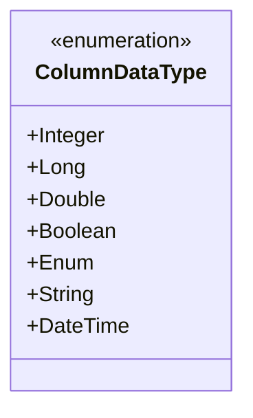
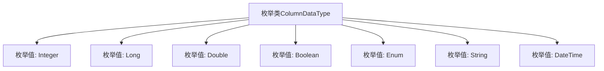

# 基础信息

|      |      |
|------|------|
| 名称 | ColumnDataType |
| 编码语言 | .java |
| 代码路径 | WeFe/common/java/common-wefe/src/main/java/com/welab/wefe/common/wefe/enums/ColumnDataType.java |
| 包名 | com.welab.wefe.common.wefe.enums |
| 依赖项 | [] |
| 概述说明 | 枚举类型ColumnDataType定义了七种数据类型：Integer、Long、Double、Boolean、Enum、String和DateTime。 |

# 说明

该枚举定义了列数据类型的种类，包含七种类型：Integer表示整数，Long表示长整数，Double表示双精度浮点数，Boolean表示布尔值，Enum表示枚举类型，String表示字符串，DateTime表示日期时间。每种类型均有注释说明其含义。

# 类列表 Class Summary

| 名称   | 类型  | 说明 |
|-------|------|-------------|
| ColumnDataType | enum | 定义列数据类型的枚举，包含整型、长整型、双精度、布尔、枚举、字符串和日期时间。 |

## 类 ColumnDataType

|      |      |
|------|------|
| 访问范围 | public |
| 类型 | enum |
| 名称 | ColumnDataType |
| 说明 | 定义列数据类型的枚举，包含整型、长整型、双精度、布尔、枚举、字符串和日期时间。 |

### UML类图

该代码定义了一个名为ColumnDataType的枚举类型，用于表示不同列数据类型。枚举包含7个常量值：Integer(整型)、Long(长整型)、Double(双精度浮点型)、Boolean(布尔型)、Enum(枚举型)、String(字符串型)和DateTime(日期时间型)。这种枚举通常用于数据库列类型定义或数据格式规范场景，通过预定义的类型集合确保类型安全性和一致性。每个枚举值都对应特定的数据类型，便于在程序中明确区分和处理不同数据格式。

### 内部方法调用关系图

该流程图展示了ColumnDataType枚举类的结构，包含7个预定义的数据类型枚举值：Integer、Long、Double、Boolean、Enum、String和DateTime。每个枚举值通过箭头与主类连接，表示它们属于ColumnDataType的成员。这种枚举类型常用于定义表格列或数据库字段的数据类型约束，为系统提供标准化的类型标识。

### 字段列表 Field List

| 名称  | 类型  | 说明 |
|-------|-------|------|

### 方法列表

| 名称  | 类型  | 说明 |
|-------|-------|------|

