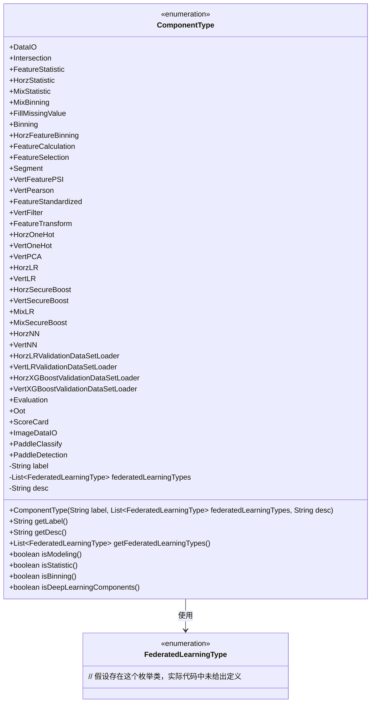

# 基础信息

|      |      |
|------|------|
| 名称 | ComponentType |
| 编码语言 | .java |
| 代码路径 | WeFe/common/java/common-wefe/src/main/java/com/welab/wefe/common/wefe/enums/ComponentType.java |
| 包名 | com.welab.wefe.common.wefe.enums |
| 依赖项 | ['java.lang.reflect.Array', 'java.util.ArrayList', 'java.util.Arrays', 'java.util.Collections', 'java.util.List', 'com.welab.wefe.common.wefe.enums.FederatedLearningType.horizontal'] |
| 概述说明 | 联邦学习组件枚举，包含数据加载、特征处理、统计分析、建模算法（逻辑回归/XGBoost/深度学习）及评估等类型，支持横向、纵向和混合联邦学习模式。 |

# 说明

该枚举类定义了联邦学习系统中的组件类型，包含数据加载、预处理、统计分析、特征工程、建模算法和评估等六大类。每个组件有中文标签、适用联邦学习类型（横向/纵向/混合）和功能描述。建模算法包括逻辑回归、XGBoost和深度学习三类，支持不同联邦模式。预处理含特征分箱、标准化、PSI计算等。特别区分了统计、分箱和深度学习组件的判定方法。所有组件通过静态列表分类管理，便于系统调用时快速识别组件属性。

# 类列表 Class Summary

| 名称   | 类型  | 说明 |
|-------|------|-------------|
| ComponentType | enum | 联邦学习组件枚举，包含数据加载、特征处理、统计分析、建模（逻辑回归/XGBoost/深度学习）及评估等类型，支持横向、纵向和混合联邦学习模式。 |

## 类 ComponentType

|      |      |
|------|------|
| 访问范围 | public |
| 类型 | enum |
| 名称 | ComponentType |
| 说明 | 联邦学习组件枚举，包含数据加载、特征处理、统计分析、建模（逻辑回归/XGBoost/深度学习）及评估等类型，支持横向、纵向和混合联邦学习模式。 |

### UML类图

这段代码定义了一个枚举类`ComponentType`，用于表示联邦学习系统中的各种组件类型。每个枚举值代表一个特定功能的组件，包含中文标签、适用的联邦学习类型列表和描述信息。类中提供了判断方法（如`isModeling()`）来检查组件是否属于特定类别（建模、统计、分箱或深度学习）。该类与`FederatedLearningType`枚举存在依赖关系，用于限定组件的适用范围。整体结构清晰地组织了联邦学习流程中的各类功能组件。

### 内部方法调用关系图

```mermaid
graph TD
    A["枚举ComponentType"]
    B["静态列表: MODELING_TYPES"]
    C["静态列表: STATISTIC_TYPES"]
    D["静态列表: BINNING_TYPES"]
    E["静态列表: DeepLearningComponents"]
    F["属性: String label"]
    G["属性: List<FederatedLearningType> federatedLearningTypes"]
    H["属性: String desc"]
    I["构造方法: ComponentType(String label, List<FederatedLearningType> federatedLearningTypes, String desc)"]
    J["方法: String getLabel()"]
    K["方法: String getDesc()"]
    L["方法: List<FederatedLearningType> getFederatedLearningTypes()"]
    M["方法: boolean isModeling()"]
    N["方法: boolean isStatistic()"]
    O["方法: boolean isBinning()"]
    P["方法: boolean isDeepLearningComponents()"]

    A --> B
    A --> C
    A --> D
    A --> E
    A --> F
    A --> G
    A --> H
    A --> I
    A --> J
    A --> K
    A --> L
    A --> M
    A --> N
    A --> O
    A --> P
```

该流程图展示了ComponentType枚举类的结构，包含4个静态组件分类列表、3个属性和7个方法。枚举定义了联邦学习系统中各类组件的类型，包括数据加载、特征处理、建模算法等，并通过静态列表和方法实现组件分类判断功能（如isModeling()）。流程图清晰呈现了枚举内部元素间的从属关系。

### 字段列表 Field List

| 名称  | 类型  | 说明 |
|-------|-------|------|

### 方法列表

| 名称  | 类型  | 说明 |
|-------|-------|------|

