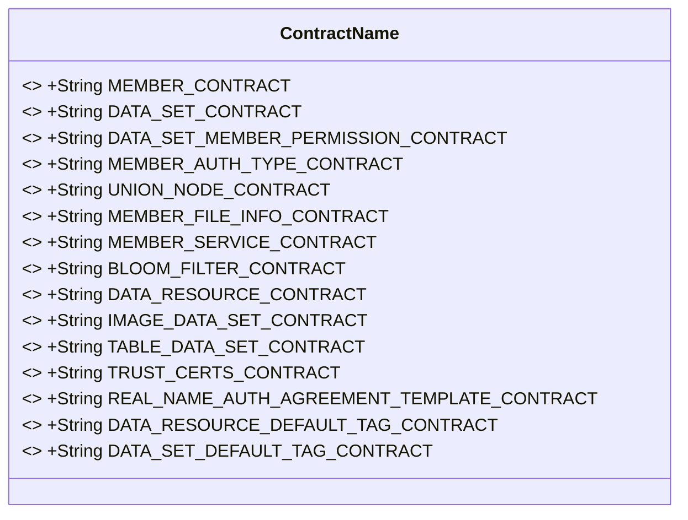

# 基础信息

|      |      |
|------|------|
| 名称 | ContractName |
| 编码语言 | .java |
| 代码路径 | WeFe/common/java/common-wefe/src/main/java/com/welab/wefe/common/wefe/enums/ContractName.java |
| 包名 | com.welab.wefe.common.wefe.enums |
| 依赖项 | [] |
| 概述说明 | ContractName类包含多个静态字符串常量，定义不同合约名称，如成员、数据集、权限、实名认证、数据源等。 |

# 说明

该代码定义了一个名为ContractName的公共类，包含多个静态常量字符串，用于表示不同类型的合约名称。这些合约涉及成员管理、数据集、权限控制、实名认证、文件服务、数据资源分类等多个领域。具体包括成员合约、数据集合约、成员数据集权限合约、实名类型合约、Union节点合约、成员文件信息合约、成员服务合约、布隆过滤器合约、数据源合约、图片资源合约、二维表资源合约、CA证书合约、实名认证协议模板合约以及两种数据集标签合约。这些常量用于统一标识系统中不同功能模块的合约名称。

# 类列表 Class Summary

| 名称   | 类型  | 说明 |
|-------|------|-------------|
| ContractName | class | ContractName类定义了多个静态常量字符串，表示不同功能的合约名称，包括成员、数据集、权限、实名认证、节点、文件、服务、过滤器、数据源、图片、表格、证书、标签等。 |

## 类 ContractName

|      |      |
|------|------|
| 访问范围 | public |
| 类型 | class |
| 名称 | ContractName |
| 说明 | ContractName类定义了多个静态常量字符串，表示不同功能的合约名称，包括成员、数据集、权限、实名认证、节点、文件、服务、过滤器、数据源、图片、表格、证书、标签等。 |

### UML类图

这段代码定义了一个名为ContractName的类，该类包含15个公共静态常量字符串字段，每个字段代表一个特定的合约名称。这些常量用于存储不同类型的合约名称，如成员合约、数据集合约、实名认证合约等。类图展示了ContractName类的结构，所有字段都是公开、静态且不可修改的(final)，用于在整个应用程序中引用这些预定义的合约名称。

### 内部方法调用关系图

```mermaid
graph TD
    A["类ContractName"]
    B["常量: MEMBER_CONTRACT = 'MemberContract'"]
    C["常量: DATA_SET_CONTRACT = 'DataSetContract'"]
    D["常量: DATA_SET_MEMBER_PERMISSION_CONTRACT = 'DataSetMemberPermissionContract'"]
    E["常量: MEMBER_AUTH_TYPE_CONTRACT = 'MemberAuthTypeContract'"]
    F["常量: UNION_NODE_CONTRACT = 'UnionNodeContract'"]
    G["常量: MEMBER_FILE_INFO_CONTRACT = 'MemberFileInfoContract'"]
    H["常量: MEMBER_SERVICE_CONTRACT = 'MemberServiceContract'"]
    I["常量: BLOOM_FILTER_CONTRACT = 'BloomFilterContract'"]
    J["常量: DATA_RESOURCE_CONTRACT = 'DataResourceContract'"]
    K["常量: IMAGE_DATA_SET_CONTRACT = 'ImageDataSetContract'"]
    L["常量: TABLE_DATA_SET_CONTRACT = 'TableDataSetContract'"]
    M["常量: TRUST_CERTS_CONTRACT = 'TrustCertsContract'"]
    N["常量: REAL_NAME_AUTH_AGREEMENT_TEMPLATE_CONTRACT = 'RealnameAuthAgreementTemplateContract'"]
    O["常量: DATA_RESOURCE_DEFAULT_TAG_CONTRACT = 'DataResourceDefaultTagContract'"]
    P["常量: DATA_SET_DEFAULT_TAG_CONTRACT = 'DataSetDefaultTagContract'"]

    A --> B
    A --> C
    A --> D
    A --> E
    A --> F
    A --> G
    A --> H
    A --> I
    A --> J
    A --> K
    A --> L
    A --> M
    A --> N
    A --> O
    A --> P
```

该流程图展示了ContractName类中定义的14个公共静态常量字符串，每个常量代表一个特定的合约名称。这些常量用于集中管理系统中各类合约的标识名称，包括成员合约、数据集合约、权限合约等，通过常量定义避免了硬编码字符串的使用，提高了代码的可维护性和可读性。所有常量均以全大写命名并通过类名直接访问。

### 字段列表 Field List

| 名称  | 类型  | 说明 |
|-------|-------|------|
| MEMBER_SERVICE_CONTRACT = "MemberServiceContract" | String | 成员服务合约常量定义 |
| DATA_SET_CONTRACT = "DataSetContract" | String | 定义常量字符串DATA_SET_CONTRACT，值为"DataSetContract"。 |
| IMAGE_DATA_SET_CONTRACT = "ImageDataSetContract" | String | 定义公共静态常量字符串IMAGE_DATA_SET_CONTRACT，值为"ImageDataSetContract"。 |
| REAL_NAME_AUTH_AGREEMENT_TEMPLATE_CONTRACT = "RealnameAuthAgreementTemplateContract" | String | 这是一个Java常量，表示实名认证协议模板合约的名称。 |
| TRUST_CERTS_CONTRACT = "TrustCertsContract" | String | 定义了一个不可变的公共静态字符串常量TRUST_CERTS_CONTRACT，值为"TrustCertsContract"。 |
| DATA_RESOURCE_CONTRACT = "DataResourceContract" | String | 定义常量字符串DATA_RESOURCE_CONTRACT，值为"DataResourceContract"。 |
| DATA_SET_MEMBER_PERMISSION_CONTRACT = "DataSetMemberPermissionContract" | String | 常量字符串，表示数据集成员权限合约的名称。 |
| TABLE_DATA_SET_CONTRACT = "TableDataSetContract" | String | 定义常量字符串TABLE_DATA_SET_CONTRACT，值为"TableDataSetContract"。 |
| MEMBER_AUTH_TYPE_CONTRACT = "MemberAuthTypeContract" | String | 定义常量字符串MEMBER_AUTH_TYPE_CONTRACT，表示成员认证类型为合约。 |
| DATA_RESOURCE_DEFAULT_TAG_CONTRACT = "DataResourceDefaultTagContract" | String | 常量字符串"DataResourceDefaultTagContract"用于标识数据资源的默认标签合约。 |
| MEMBER_CONTRACT = "MemberContract" | String | 定义了一个公共静态常量字符串MEMBER_CONTRACT，值为"MemberContract"。 |
| UNION_NODE_CONTRACT = "UnionNodeContract" | String | 定义公共静态常量字符串UNION_NODE_CONTRACT，值为"UnionNodeContract"。 |
| BLOOM_FILTER_CONTRACT = "BloomFilterContract" | String | 定义常量字符串BLOOM_FILTER_CONTRACT，值为"BloomFilterContract"。 |
| MEMBER_FILE_INFO_CONTRACT = "MemberFileInfoContract" | String | 定义了一个公共静态常量字符串MEMBER_FILE_INFO_CONTRACT，值为"MemberFileInfoContract"。 |
| DATA_SET_DEFAULT_TAG_CONTRACT = "DataSetDefaultTagContract" | String | 定义静态常量字符串DATA_SET_DEFAULT_TAG_CONTRACT，值为"DataSetDefaultTagContract"。 |

### 方法列表

| 名称  | 类型  | 说明 |
|-------|-------|------|

