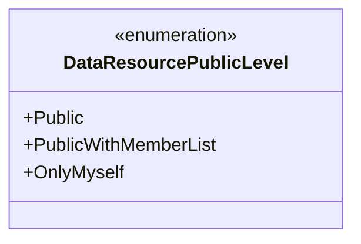
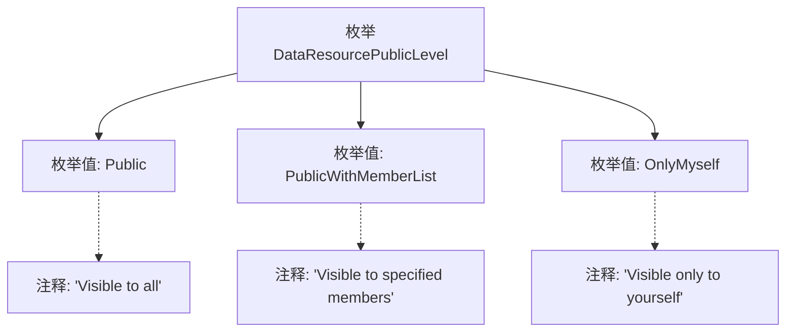

# 基础信息

|      |      |
|------|------|
| 名称 | DataResourcePublicLevel |
| 编码语言 | .java |
| 代码路径 | WeFe/common/java/common-wefe/src/main/java/com/welab/wefe/common/wefe/enums/DataResourcePublicLevel.java |
| 包名 | com.welab.wefe.common.wefe.enums |
| 依赖项 | [] |
| 概述说明 | 数据资源公开级别枚举：Public（所有人可见）、PublicWithMemberList（指定成员可见）、OnlyMyself（仅自己可见）。 |

# 说明

该枚举定义了数据资源的公开级别，包含三个选项：Public表示对所有用户可见；PublicWithMemberList表示仅对指定成员可见；OnlyMyself表示仅对用户自己可见。每个选项都有明确的注释说明其可见范围。

# 类列表 Class Summary

| 名称   | 类型  | 说明 |
|-------|------|-------------|
| DataResourcePublicLevel | enum | DataResourcePublicLevel枚举定义数据资源公开级别：Public（所有人可见）、PublicWithMemberList（指定成员可见）、OnlyMyself（仅自己可见）。 |

## 类 DataResourcePublicLevel

|      |      |
|------|------|
| 访问范围 | public |
| 类型 | enum |
| 名称 | DataResourcePublicLevel |
| 说明 | DataResourcePublicLevel枚举定义数据资源公开级别：Public（所有人可见）、PublicWithMemberList（指定成员可见）、OnlyMyself（仅自己可见）。 |

### UML类图

该类图展示了一个枚举类型`DataResourcePublicLevel`，它定义了数据资源的三种公开级别：`Public`表示对所有用户可见，`PublicWithMemberList`表示仅对指定成员列表可见，`OnlyMyself`表示仅对资源所有者本人可见。枚举类型通过<<enumeration>>标记明确标识，所有枚举值均为公有常量，用于控制数据访问权限的粒度。这种设计常用于需要精细化权限管理的系统架构中。

### 内部方法调用关系图

该流程图展示了DataResourcePublicLevel枚举的结构，包含三个枚举值（Public、PublicWithMemberList、OnlyMyself）及其对应的注释说明。Public表示资源对所有用户可见，PublicWithMemberList表示仅对指定成员可见，OnlyMyself表示仅对资源所有者可见。箭头连接表示枚举类与各枚举值及注释的从属关系，清晰呈现了不同可见级别的权限定义。

### 字段列表 Field List

| 名称  | 类型  | 说明 |
|-------|-------|------|

### 方法列表

| 名称  | 类型  | 说明 |
|-------|-------|------|

