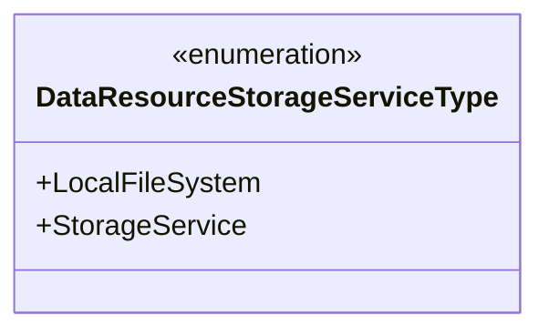
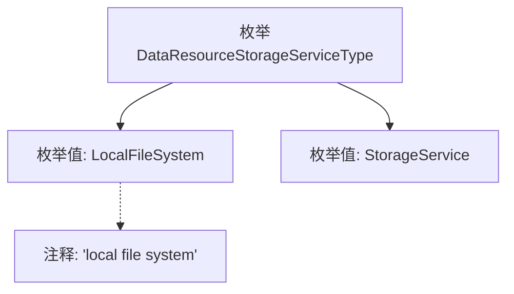

# 基础信息

|      |      |
|------|------|
| 名称 | DataResourceStorageServiceType |
| 编码语言 | .java |
| 代码路径 | WeFe/common/java/common-wefe/src/main/java/com/welab/wefe/common/wefe/enums/DataResourceStorageServiceType.java |
| 包名 | com.welab.wefe.common.wefe.enums |
| 依赖项 | [] |
| 概述说明 | 枚举DataResourceStorageServiceType定义两种存储类型：本地文件系统和存储服务。 |

# 说明

该内容定义了一个名为DataResourceStorageServiceType的枚举类型，包含两个枚举值：LocalFileSystem和StorageService。其中LocalFileSystem表示本地文件系统存储方式，StorageService表示通用存储服务类型。枚举用于标识不同的数据资源存储服务类型。

# 类列表 Class Summary

| 名称   | 类型  | 说明 |
|-------|------|-------------|
| DataResourceStorageServiceType | enum | 枚举定义数据资源存储服务类型，包含本地文件系统和存储服务两种选项。 |

## 类 DataResourceStorageServiceType

|      |      |
|------|------|
| 访问范围 | public |
| 类型 | enum |
| 名称 | DataResourceStorageServiceType |
| 说明 | 枚举定义数据资源存储服务类型，包含本地文件系统和存储服务两种选项。 |

### UML类图

这段代码定义了一个名为DataResourceStorageServiceType的枚举类型，包含两个枚举常量：LocalFileSystem和StorageService。LocalFileSystem表示使用本地文件系统作为数据存储服务，StorageService则代表通用的存储服务类型。枚举类型在类图中用<<enumeration>>标记，清晰地展示了该类型的有限值集合和简单结构。这种设计常用于表示固定的服务类型或配置选项，便于类型安全地管理不同的存储服务实现方式。

### 内部方法调用关系图

该流程图展示了DataResourceStorageServiceType枚举的结构，包含两个枚举值LocalFileSystem和StorageService，其中LocalFileSystem带有说明其为本地文件系统的注释。枚举作为一种特殊的数据类型，用于定义一组固定的常量，此处明确区分了两种不同的数据存储服务类型，便于在代码中清晰引用和维护。

### 字段列表 Field List

| 名称  | 类型  | 说明 |
|-------|-------|------|

### 方法列表

| 名称  | 类型  | 说明 |
|-------|-------|------|

