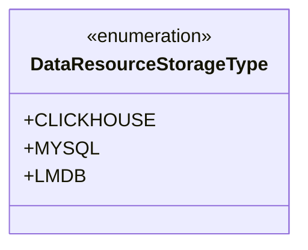
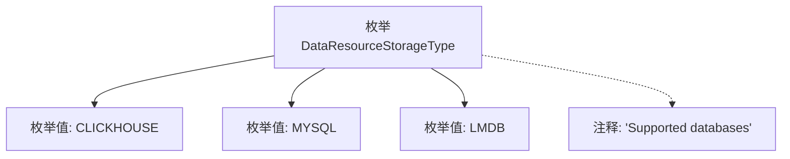

# 基础信息

|      |      |
|------|------|
| 名称 | DataResourceStorageType |
| 编码语言 | .java |
| 代码路径 | WeFe/common/java/common-wefe/src/main/java/com/welab/wefe/common/wefe/enums/DataResourceStorageType.java |
| 包名 | com.welab.wefe.common.wefe.enums |
| 依赖项 | [] |
| 概述说明 | 数据资源存储类型枚举：支持CLICKHOUSE、MYSQL、LMDB数据库。 |

# 说明

该内容定义了一个名为DataResourceStorageType的公共枚举类型，包含三种数据库存储类型：CLICKHOUSE、MYSQL和LMDB。注释说明这些是支持的数据库类型。枚举用于表示不同的数据资源存储方式，不包含具体实现细节。

# 类列表 Class Summary

| 名称   | 类型  | 说明 |
|-------|------|-------------|
| DataResourceStorageType | enum | DataResourceStorageType枚举定义了支持的数据库类型：CLICKHOUSE、MYSQL和LMDB。 |

## 类 DataResourceStorageType

|      |      |
|------|------|
| 访问范围 | public |
| 类型 | enum |
| 名称 | DataResourceStorageType |
| 说明 | DataResourceStorageType枚举定义了支持的数据库类型：CLICKHOUSE、MYSQL和LMDB。 |

### UML类图

这段代码定义了一个名为DataResourceStorageType的枚举类型，包含三个枚举常量：CLICKHOUSE、MYSQL和LMDB。枚举类型用于表示一组固定的常量值，这里明确指定了三种支持的数据库类型。枚举类型在类图中用<<enumeration>>标记，其常量值作为公有静态成员列出。这种设计常用于限制数据资源存储类型的取值范围，确保类型安全性和代码可读性。

### 内部方法调用关系图

这段代码定义了一个名为DataResourceStorageType的枚举类型，包含CLICKHOUSE、MYSQL和LMDB三个枚举值，并附带注释说明这些是支持的数据库类型。流程图展示了枚举类与各枚举值之间的包含关系，以及注释与枚举类的关联。该枚举可能用于标识或选择不同类型的数据存储资源，适用于需要明确限定存储类型的场景。

### 字段列表 Field List

| 名称  | 类型  | 说明 |
|-------|-------|------|

### 方法列表

| 名称  | 类型  | 说明 |
|-------|-------|------|

