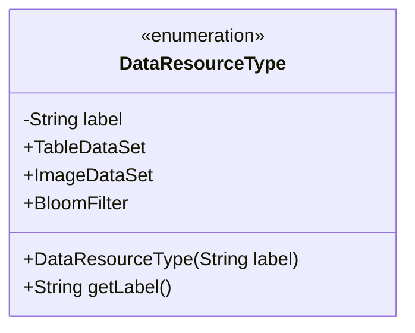
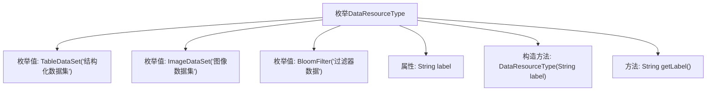

# 基础信息

|      |      |
|------|------|
| 名称 | DataResourceType |
| 编码语言 | .java |
| 代码路径 | WeFe/common/java/common-wefe/src/main/java/com/welab/wefe/common/wefe/enums/DataResourceType.java |
| 包名 | com.welab.wefe.common.wefe.enums |
| 依赖项 | [] |
| 概述说明 | DataResourceType枚举定义三种数据类型：结构化数据集（常规机器学习）、图像数据集（深度学习）、过滤器数据（布隆过滤器）。 |

# 说明

该枚举定义了三种数据资源类型：TableDataSet表示结构化数据集，适用于常规机器学习；ImageDataSet表示图像数据集，用于深度学习；BloomFilter表示过滤器数据。每种类型都有对应的中文标签，可通过getLabel方法获取。枚举通过私有构造器确保标签不可变。

# 类列表 Class Summary

| 名称   | 类型  | 说明 |
|-------|------|-------------|
| DataResourceType | enum | 枚举DataResourceType定义三种数据类型：TableDataSet（结构化数据集）、ImageDataSet（图像数据集）、BloomFilter（过滤器数据），各类型有对应标签。 |

## 类 DataResourceType

|      |      |
|------|------|
| 访问范围 | public |
| 类型 | enum |
| 名称 | DataResourceType |
| 说明 | 枚举DataResourceType定义三种数据类型：TableDataSet（结构化数据集）、ImageDataSet（图像数据集）、BloomFilter（过滤器数据），各类型有对应标签。 |

### UML类图

该图展示了一个枚举类`DataResourceType`，它定义了三种数据资源类型：结构化数据集、图像数据集和过滤器数据。每个枚举值都有一个关联的标签描述，通过私有字段`label`存储，并通过公有方法`getLabel()`访问。枚举类通过构造函数初始化标签值，适用于需要明确分类数据源类型的场景。

### 内部方法调用关系图

这段代码定义了一个名为DataResourceType的枚举类型，包含三个枚举值：TableDataSet（结构化数据集）、ImageDataSet（图像数据集）和BloomFilter（过滤器数据）。每个枚举值都有一个关联的标签字符串，通过构造方法初始化，并提供了getLabel()方法来获取标签。该枚举用于表示不同类型的数据资源，适用于机器学习、深度学习和过滤场景。流程图清晰地展示了枚举结构、属性、构造方法和方法之间的层级关系。

### 字段列表 Field List

| 名称  | 类型  | 说明 |
|-------|-------|------|

### 方法列表

| 名称  | 类型  | 说明 |
|-------|-------|------|

