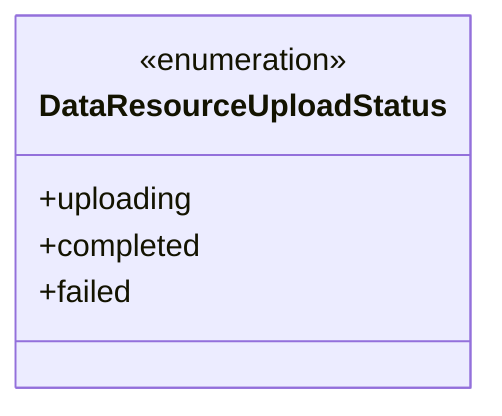
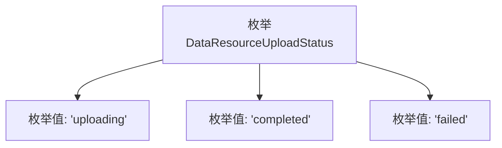

# 基础信息

|      |      |
|------|------|
| 名称 | DataResourceUploadStatus |
| 编码语言 | .java |
| 代码路径 | WeFe/common/java/common-wefe/src/main/java/com/welab/wefe/common/wefe/enums/DataResourceUploadStatus.java |
| 包名 | com.welab.wefe.common.wefe.enums |
| 依赖项 | [] |
| 概述说明 | 数据资源上传状态枚举：上传中、完成、失败。 |

# 说明

该内容定义了一个名为DataResourceUploadStatus的公共枚举类型，包含三个状态值：uploading表示数据资源正在上传中，completed表示上传已完成，failed表示上传失败。枚举用于描述数据资源上传过程中的不同状态。

# 类列表 Class Summary

| 名称   | 类型  | 说明 |
|-------|------|-------------|
| DataResourceUploadStatus | enum | 数据资源上传状态枚举：上传中、完成、失败。 |

## 类 DataResourceUploadStatus

|      |      |
|------|------|
| 访问范围 | public |
| 类型 | enum |
| 名称 | DataResourceUploadStatus |
| 说明 | 数据资源上传状态枚举：上传中、完成、失败。 |

### UML类图

该枚举类定义了数据资源上传的三种状态：上传中(uploading)、已完成(completed)和失败(failed)。作为枚举类型，它通过固定常量值确保状态类型的唯一性和安全性，常用于文件上传、数据处理等场景的状态跟踪。枚举实例默认具有序号(ordinal)和名称(name)属性，可通过values()方法获取所有枚举值。这种设计避免了魔法字符串，增强了代码可读性和可维护性。

### 内部方法调用关系图

该流程图展示了DataResourceUploadStatus枚举的结构，包含三个固定状态：uploading（上传中）、completed（已完成）和failed（失败）。每个枚举值作为独立节点与枚举主体相连，表示这是该枚举类型所有可能的实例值。这种设计常用于表示有限且明确的状态集合，适用于文件上传等需要明确状态跟踪的场景。

### 字段列表 Field List

| 名称  | 类型  | 说明 |
|-------|-------|------|

### 方法列表

| 名称  | 类型  | 说明 |
|-------|-------|------|

