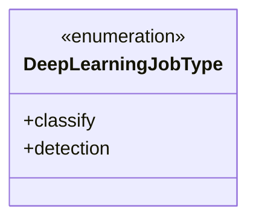
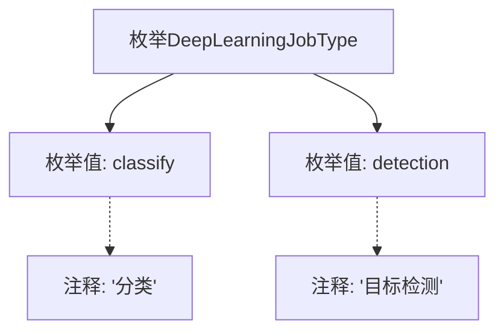

# 基础信息

|      |      |
|------|------|
| 名称 | DeepLearningJobType |
| 编码语言 | .java |
| 代码路径 | WeFe/common/java/common-wefe/src/main/java/com/welab/wefe/common/wefe/enums/DeepLearningJobType.java |
| 包名 | com.welab.wefe.common.wefe.enums |
| 依赖项 | [] |
| 概述说明 | DeepLearningJobType枚举定义两种深度学习任务类型：分类和目标检测。 |

# 说明

该内容定义了一个名为DeepLearningJobType的公共枚举类型，包含两个枚举值：classify和detection。classify表示分类任务，detection表示目标检测任务。每个枚举值都配有对应的中文注释说明其用途。该枚举用于区分不同类型的深度学习任务。

# 类列表 Class Summary

| 名称   | 类型  | 说明 |
|-------|------|-------------|
| DeepLearningJobType | enum | DeepLearningJobType枚举定义两种深度学习任务类型：分类和目标检测。 |

## 类 DeepLearningJobType

|      |      |
|------|------|
| 访问范围 | public |
| 类型 | enum |
| 名称 | DeepLearningJobType |
| 说明 | DeepLearningJobType枚举定义两种深度学习任务类型：分类和目标检测。 |

### UML类图

这段代码定义了一个名为DeepLearningJobType的枚举类型，包含两个枚举常量：classify（分类）和detection（目标检测）。枚举类型用于表示一组固定的常量值，这里专门用于标识深度学习任务的类型。该枚举没有定义任何方法或额外属性，仅作为类型标识使用，适合在需要明确区分不同深度学习任务场景的代码中使用。枚举的简洁设计使其易于扩展和维护，同时保证了类型安全性。

### 内部方法调用关系图

该流程图展示了DeepLearningJobType枚举的结构，包含两个枚举值classify和detection，分别对应"分类"和"目标检测"的注释说明。枚举作为特殊类类型，通过graph TD呈现其静态成员关系，注释通过虚线箭头关联到对应枚举值，整体结构清晰展示了深度学习任务类型的定义方式。

### 字段列表 Field List

| 名称  | 类型  | 说明 |
|-------|-------|------|

### 方法列表

| 名称  | 类型  | 说明 |
|-------|-------|------|

