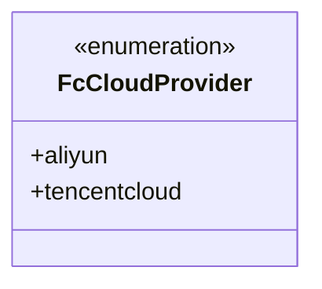
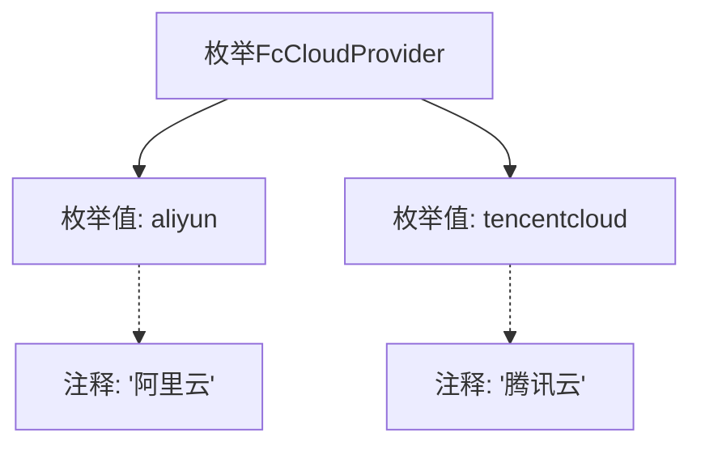

# 基础信息

|      |      |
|------|------|
| 名称 | FcCloudProvider |
| 编码语言 | .java |
| 代码路径 | WeFe/common/java/common-wefe/src/main/java/com/welab/wefe/common/wefe/enums/FcCloudProvider.java |
| 包名 | com.welab.wefe.common.wefe.enums |
| 依赖项 | [] |
| 概述说明 | 枚举FcCloudProvider定义两种云服务提供商：阿里云和腾讯云。 |

# 说明

该代码定义了一个名为FcCloudProvider的枚举类型，包含两个枚举值：aliyun表示阿里云，tencentcloud表示腾讯云。枚举用于标识不同的云服务提供商。

# 类列表 Class Summary

| 名称   | 类型  | 说明 |
|-------|------|-------------|
| FcCloudProvider | enum | 枚举FcCloudProvider定义了两个云服务提供商：阿里云(aliyun)和腾讯云(tencentcloud)。 |

## 类 FcCloudProvider

|      |      |
|------|------|
| 访问范围 | public |
| 类型 | enum |
| 名称 | FcCloudProvider |
| 说明 | 枚举FcCloudProvider定义了两个云服务提供商：阿里云(aliyun)和腾讯云(tencentcloud)。 |

### UML类图

这段类图描述了一个名为FcCloudProvider的枚举类型，它定义了两种云服务提供商：aliyun（阿里云）和tencentcloud（腾讯云）。枚举类型在类图中用<<enumeration>>标记，表示它是一个固定的值集合。这个枚举可能用于在系统中标识不同的云平台，以便进行平台特定的操作或配置。枚举值是公有的，因此用+号表示，它们作为FcCloudProvider的静态成员存在。

### 内部方法调用关系图

该流程图展示了FcCloudProvider枚举的结构，包含两个枚举值aliyun和tencentcloud，分别对应中文注释"阿里云"和"腾讯云"。枚举类作为父节点，通过箭头连接其枚举值和相关注释，清晰地呈现了代码的静态结构关系。这种表示方式突出了枚举类型的简单性和自文档化特性。

### 字段列表 Field List

| 名称  | 类型  | 说明 |
|-------|-------|------|

### 方法列表

| 名称  | 类型  | 说明 |
|-------|-------|------|

