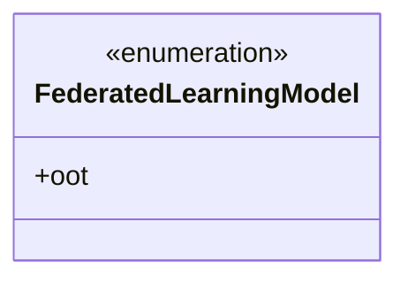
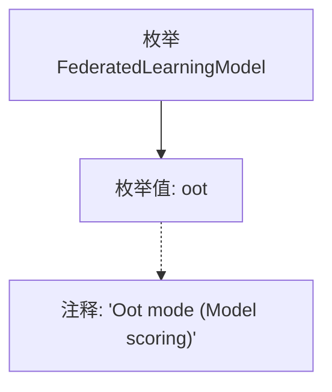

# 基础信息

|      |      |
|------|------|
| 名称 | FederatedLearningModel |
| 编码语言 | .java |
| 代码路径 | WeFe/common/java/common-wefe/src/main/java/com/welab/wefe/common/wefe/enums/FederatedLearningModel.java |
| 包名 | com.welab.wefe.common.wefe.enums |
| 依赖项 | [] |
| 概述说明 | 联邦学习模型枚举包含OOT模式（模型评分）。 |

# 说明

该内容定义了一个名为FederatedLearningModel的公共枚举类型，其中包含一个枚举值oot。oot的注释说明其用途为模型评分模式（Model scoring）。枚举用于表示联邦学习模型的特定模式，此处仅包含一个模式选项。整个定义简洁明了，直接关联到联邦学习场景下的模型评分功能。

# 类列表 Class Summary

| 名称   | 类型  | 说明 |
|-------|------|-------------|
| FederatedLearningModel | enum | 联邦学习模型枚举包含OOT模式（模型评分）。 |

## 类 FederatedLearningModel

|      |      |
|------|------|
| 访问范围 | public |
| 类型 | enum |
| 名称 | FederatedLearningModel |
| 说明 | 联邦学习模型枚举包含OOT模式（模型评分）。 |

### UML类图

这段类图展示了一个简单的枚举类型FederatedLearningModel，它目前只包含一个枚举值oot。作为枚举类型，它被标记为<<enumeration>>，表示这是一个固定的值集合。oot是该枚举的唯一公开成员，用于表示联邦学习模型中的OOT(Out of Time)模式，主要用于模型评分场景。这种设计模式常用于定义系统中有限的、预定义的选项集合。

### 内部方法调用关系图

该流程图描述了FederatedLearningModel枚举的结构，包含一个名为oot的枚举值，并附有说明其用途的注释"Oot mode (Model scoring)"。整个结构简洁明了，展示了枚举定义与文档注释的关联关系，适用于表示联邦学习中的模型评分模式。

### 字段列表 Field List

| 名称  | 类型  | 说明 |
|-------|-------|------|

### 方法列表

| 名称  | 类型  | 说明 |
|-------|-------|------|

