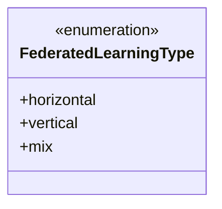
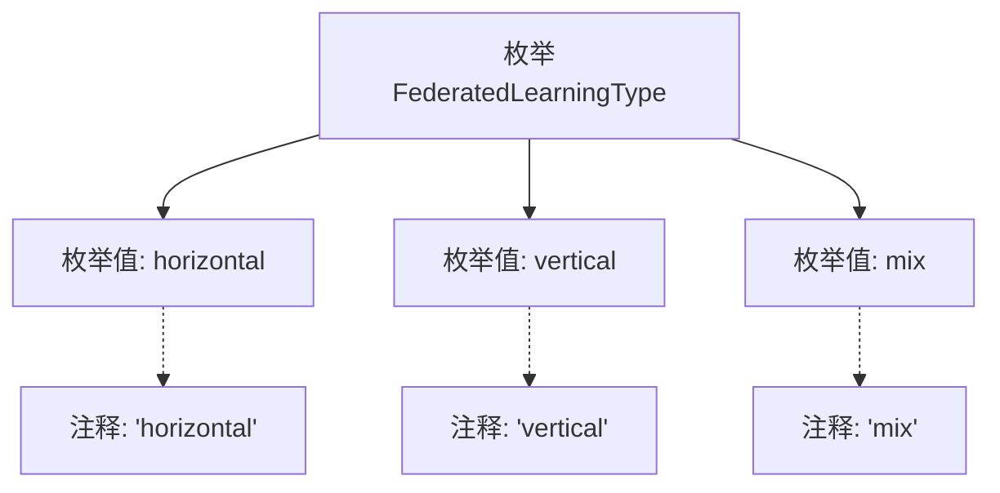

# 基础信息

|      |      |
|------|------|
| 名称 | FederatedLearningType |
| 编码语言 | .java |
| 代码路径 | WeFe/common/java/common-wefe/src/main/java/com/welab/wefe/common/wefe/enums/FederatedLearningType.java |
| 包名 | com.welab.wefe.common.wefe.enums |
| 依赖项 | [] |
| 概述说明 | 枚举FederatedLearningType定义了三种联邦学习类型：horizontal（横向）、vertical（纵向）和mix（混合）。 |

# 说明

该代码定义了一个名为FederatedLearningType的枚举类型，包含三个枚举值：horizontal（横向联邦学习）、vertical（纵向联邦学习）和mix（混合联邦学习）。每个枚举值都有对应的注释说明其含义。该枚举用于表示不同类型的联邦学习方式。

# 类列表 Class Summary

| 名称   | 类型  | 说明 |
|-------|------|-------------|
| FederatedLearningType | enum | 枚举定义了联邦学习的三种类型：横向、纵向和混合。 |

## 类 FederatedLearningType

|      |      |
|------|------|
| 访问范围 | public |
| 类型 | enum |
| 名称 | FederatedLearningType |
| 说明 | 枚举定义了联邦学习的三种类型：横向、纵向和混合。 |

### UML类图

这段代码定义了一个名为`FederatedLearningType`的枚举类型，包含三个枚举常量：`horizontal`（水平联邦学习）、`vertical`（垂直联邦学习）和`mix`（混合联邦学习）。枚举类型通常用于表示一组固定的常量值，这里用于标识不同类型的联邦学习方式。由于是枚举类型，所有成员默认都是公有的，且不需要显式声明访问修饰符。

### 内部方法调用关系图

该流程图展示了FederatedLearningType枚举的结构，包含三个枚举值（horizontal、vertical、mix）及其对应的注释说明。枚举作为特殊类类型，通过graph TD方向呈现层级关系，主节点连接各枚举值，而注释通过虚线箭头关联。图形清晰体现了枚举的定义方式和文档标注规范，适用于表示联邦学习的三种类型分类。

### 字段列表 Field List

| 名称  | 类型  | 说明 |
|-------|-------|------|

### 方法列表

| 名称  | 类型  | 说明 |
|-------|-------|------|

