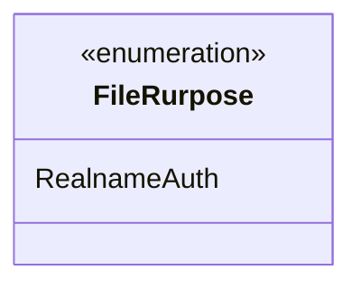
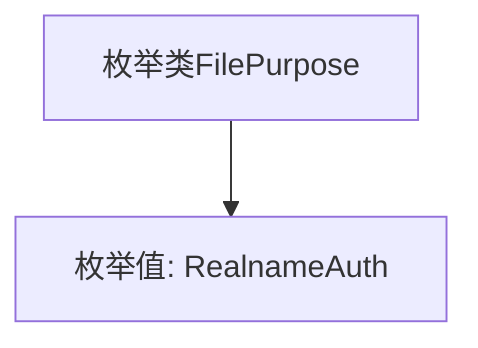

# 基础信息

|      |      |
|------|------|
| 名称 | FileRurpose |
| 编码语言 | .java |
| 代码路径 | WeFe/common/java/common-wefe/src/main/java/com/welab/wefe/common/wefe/enums/FileRurpose.java |
| 包名 | com.welab.wefe.common.wefe.enums |
| 依赖项 | [] |
| 概述说明 | 枚举类型FileRurpose定义了一个值RealnameAuth，用于实名认证场景。 |

# 说明

该内容定义了一个名为FileRurpose的公共枚举类型，其中包含一个枚举值RealnameAuth。枚举用于表示文件用途，当前仅支持实名认证这一种用途。结构简洁明了，未包含其他成员或复杂逻辑。

# 类列表 Class Summary

| 名称   | 类型  | 说明 |
|-------|------|-------------|
| FileRurpose | enum | 枚举类型FileRurpose定义了一个值RealnameAuth，用于实名认证场景。 |

## 类 FileRurpose

|      |      |
|------|------|
| 访问范围 | public |
| 类型 | enum |
| 名称 | FileRurpose |
| 说明 | 枚举类型FileRurpose定义了一个值RealnameAuth，用于实名认证场景。 |

### UML类图

这段代码定义了一个名为`FileRurpose`的枚举类型，目前仅包含一个枚举常量`RealnameAuth`。枚举在类图中用`<<enumeration>>`标记表示，其内部列出了所有枚举值。该枚举可能用于表示文件用途的类型，例如实名认证场景。由于枚举类型是特殊的类，因此类图展示其结构时需明确标注枚举特性。

### 内部方法调用关系图

这段代码定义了一个名为`FilePurpose`的枚举类，其中包含一个枚举值`RealnameAuth`。枚举类通常用于表示一组固定的常量，这里可能用于标识文件用途的类型。流程图展示了类与唯一枚举值的简单层级关系，适用于需要严格限定文件用途的场景。

### 字段列表 Field List

| 名称  | 类型  | 说明 |
|-------|-------|------|

### 方法列表

| 名称  | 类型  | 说明 |
|-------|-------|------|

