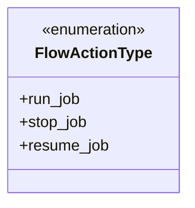
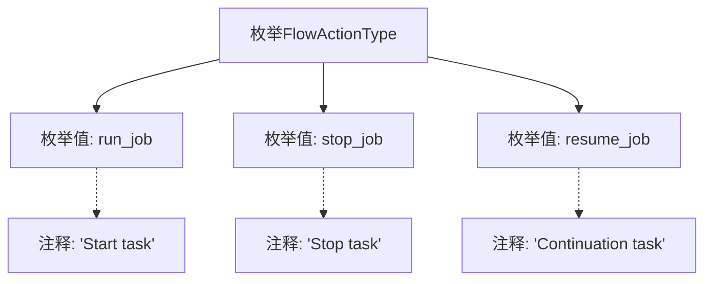

# 基础信息

|      |      |
|------|------|
| 名称 | FlowActionType |
| 编码语言 | .java |
| 代码路径 | WeFe/common/java/common-wefe/src/main/java/com/welab/wefe/common/wefe/enums/FlowActionType.java |
| 包名 | com.welab.wefe.common.wefe.enums |
| 依赖项 | [] |
| 概述说明 | FlowActionType枚举定义了三种任务操作：run_job启动任务，stop_job停止任务，resume_job继续任务。 |

# 说明

该内容定义了一个名为FlowActionType的枚举类型，包含三个枚举值：run_job表示启动任务，stop_job表示停止任务，resume_job表示继续任务。每个枚举值都有对应的注释说明其功能。

# 类列表 Class Summary

| 名称   | 类型  | 说明 |
|-------|------|-------------|
| FlowActionType | enum | FlowActionType枚举定义了三种任务操作：run_job启动任务，stop_job停止任务，resume_job继续任务。 |

## 类 FlowActionType

|      |      |
|------|------|
| 访问范围 | public |
| 类型 | enum |
| 名称 | FlowActionType |
| 说明 | FlowActionType枚举定义了三种任务操作：run_job启动任务，stop_job停止任务，resume_job继续任务。 |

### UML类图

这段代码定义了一个名为`FlowActionType`的枚举类型，包含三个枚举常量：`run_job`表示启动任务，`stop_job`表示停止任务，`resume_job`表示继续任务。枚举类型用于表示一组固定的常量值，常用于状态管理或选项控制场景。该枚举清晰地定义了工作流中可能触发的三种基本操作类型，为系统提供了类型安全的操作标识。

### 内部方法调用关系图

该流程图展示了FlowActionType枚举的结构，包含三个枚举值：run_job（启动任务）、stop_job（停止任务）和resume_job（继续任务），每个枚举值均附带对应的英文注释说明其功能。图形通过虚线连接表示注释与枚举值的关联关系，整体呈现了枚举类的定义方式和文档化特征。

### 字段列表 Field List

| 名称  | 类型  | 说明 |
|-------|-------|------|

### 方法列表

| 名称  | 类型  | 说明 |
|-------|-------|------|

