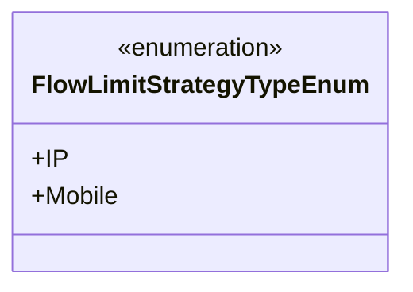
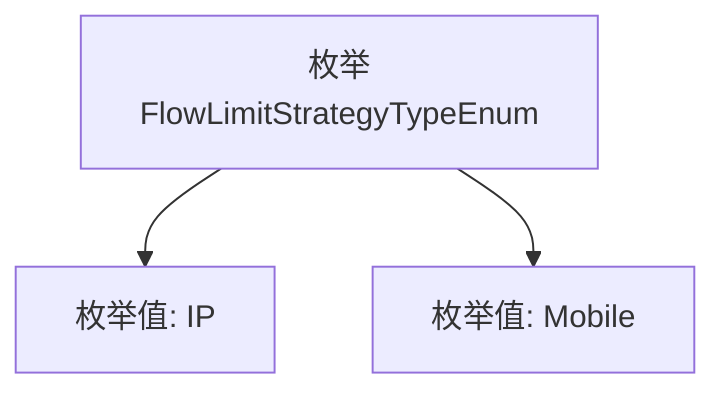

# 基础信息

|      |      |
|------|------|
| 名称 | FlowLimitStrategyTypeEnum |
| 编码语言 | .java |
| 代码路径 | WeFe/common/java/common-wefe/src/main/java/com/welab/wefe/common/wefe/enums/FlowLimitStrategyTypeEnum.java |
| 包名 | com.welab.wefe.common.wefe.enums |
| 依赖项 | [] |
| 概述说明 | FlowLimitStrategyTypeEnum枚举定义了两种限流策略类型：IP和Mobile。 |

# 说明

该内容定义了一个名为FlowLimitStrategyTypeEnum的公共枚举类型，包含两个枚举常量：IP和Mobile。该枚举可能用于表示流量限制策略的类型，IP代表基于IP地址的限制，Mobile代表基于移动设备的限制。枚举结构简洁，仅包含这两个选项，没有其他属性或方法。

# 类列表 Class Summary

| 名称   | 类型  | 说明 |
|-------|------|-------------|
| FlowLimitStrategyTypeEnum | enum | 枚举类定义两种流控策略类型：IP和Mobile。 |

## 类 FlowLimitStrategyTypeEnum

|      |      |
|------|------|
| 访问范围 | public |
| 类型 | enum |
| 名称 | FlowLimitStrategyTypeEnum |
| 说明 | 枚举类定义两种流控策略类型：IP和Mobile。 |

### UML类图

这段代码定义了一个名为FlowLimitStrategyTypeEnum的枚举类型，包含两个枚举常量：IP和Mobile。枚举类型通常用于表示一组固定的常量值，这里可能用于标识流量限制的策略类型（IP限制或手机号限制）。类图清晰地展示了枚举的结构，使用<<enumeration>>标记表明这是一个枚举类，并列出了其所有公开的枚举值。

### 内部方法调用关系图

这段代码定义了一个名为FlowLimitStrategyTypeEnum的枚举类型，包含两个枚举值IP和Mobile。该枚举可能用于表示流量限制策略的类型，其中IP代表基于IP地址的限制策略，Mobile代表基于移动设备的限制策略。枚举类型通过简洁的方式限定了可选的策略类型，确保类型安全并避免无效输入。

### 字段列表 Field List

| 名称  | 类型  | 说明 |
|-------|-------|------|

### 方法列表

| 名称  | 类型  | 说明 |
|-------|-------|------|

