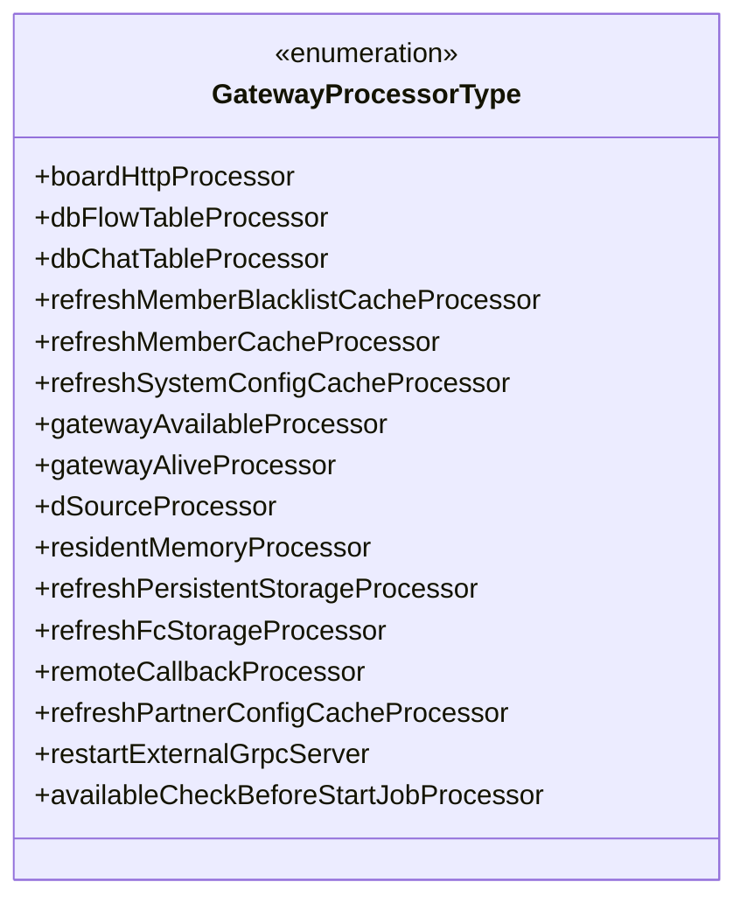

# 基础信息

|      |      |
|------|------|
| 名称 | GatewayProcessorType |
| 编码语言 | .java |
| 代码路径 | WeFe/common/java/common-wefe/src/main/java/com/welab/wefe/common/wefe/enums/GatewayProcessorType.java |
| 包名 | com.welab.wefe.common.wefe.enums |
| 依赖项 | [] |
| 概述说明 | GatewayProcessorType枚举定义了多种网关处理器类型，包括HTTP推送、数据库存储、缓存刷新、网关检查和外部服务管理等关键功能模块。 |

# 说明

该枚举类型定义了多种网关处理器类型，涵盖消息处理、数据存储、缓存刷新、网关状态检查等功能。具体包括HTTP推送至看板消息处理器、MySQL流表和聊天表存储处理器、成员黑名单和系统配置缓存刷新处理器、网关可用性和存活状态检查处理器、数据源处理器、常驻内存处理器、持久存储和FC存储刷新处理器、远程回调处理器、合作伙伴配置缓存刷新处理器、外部gRPC服务重启处理器以及任务启动前可用性检查处理器。这些处理器类型全面覆盖了网关系统的核心业务需求。

# 类列表 Class Summary

| 名称   | 类型  | 说明 |
|-------|------|-------------|
| GatewayProcessorType | enum | GatewayProcessorType枚举定义了多种网关处理器类型，包括HTTP推送、数据库存储、缓存刷新、网关检查等。 |

## 类 GatewayProcessorType

|      |      |
|------|------|
| 访问范围 | public |
| 类型 | enum |
| 名称 | GatewayProcessorType |
| 说明 | GatewayProcessorType枚举定义了多种网关处理器类型，包括HTTP推送、数据库存储、缓存刷新、网关检查等。 |

### UML类图

这段代码定义了一个名为GatewayProcessorType的枚举类型，包含了15种不同的处理器类型，每种类型对应网关系统中的特定功能模块。这些处理器涵盖了消息推送、数据库操作、缓存刷新、网关状态检查、存储管理、远程回调等核心功能，构成了网关系统的完整处理能力集合。枚举值通过清晰的命名和注释表明了各自用途，如boardHttpProcessor处理HTTP推送消息，dbFlowTableProcessor处理MySQL流表存储等，体现了网关系统模块化设计的架构思想。

### 内部方法调用关系图

```mermaid
graph TD
    A["枚举类GatewayProcessorType"]
    B["枚举值: boardHttpProcessor"]
    C["枚举值: dbFlowTableProcessor"]
    D["枚举值: dbChatTableProcessor"]
    E["枚举值: refreshMemberBlacklistCacheProcessor"]
    F["枚举值: refreshMemberCacheProcessor"]
    G["枚举值: refreshSystemConfigCacheProcessor"]
    H["枚举值: gatewayAvailableProcessor"]
    I["枚举值: gatewayAliveProcessor"]
    J["枚举值: dSourceProcessor"]
    K["枚举值: residentMemoryProcessor"]
    L["枚举值: refreshPersistentStorageProcessor"]
    M["枚举值: refreshFcStorageProcessor"]
    N["枚举值: remoteCallbackProcessor"]
    O["枚举值: refreshPartnerConfigCacheProcessor"]
    P["枚举值: restartExternalGrpcServer"]
    Q["枚举值: availableCheckBeforeStartJobProcessor"]

    A --> B
    A --> C
    A --> D
    A --> E
    A --> F
    A --> G
    A --> H
    A --> I
    A --> J
    A --> K
    A --> L
    A --> M
    A --> N
    A --> O
    A --> P
    A --> Q
```

该流程图展示了GatewayProcessorType枚举类的完整结构，包含15个具有明确业务含义的枚举值。这些枚举值分别对应不同的网关处理类型，包括HTTP推送、数据库存储、缓存刷新、网关状态检查、远程回调等处理器类型。每个枚举值都通过注释清晰描述了其具体功能用途，形成了一套完整的网关处理类型分类体系。

### 字段列表 Field List

| 名称  | 类型  | 说明 |
|-------|-------|------|

### 方法列表

| 名称  | 类型  | 说明 |
|-------|-------|------|

