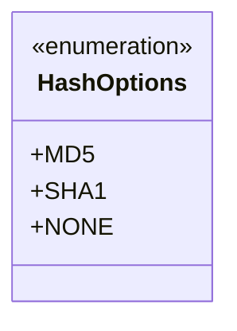
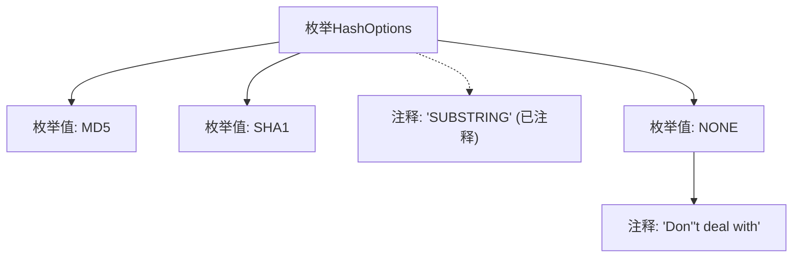

# 基础信息

|      |      |
|------|------|
| 名称 | HashOptions |
| 编码语言 | .java |
| 代码路径 | WeFe/common/java/common-wefe/src/main/java/com/welab/wefe/common/wefe/enums/HashOptions.java |
| 包名 | com.welab.wefe.common.wefe.enums |
| 依赖项 | [] |
| 概述说明 | 哈希算法选项枚举：MD5、SHA1、NONE（不处理）。 |

# 说明

该内容定义了一个名为HashOptions的枚举类型，包含三个可选项：MD5、SHA1和NONE。其中MD5和SHA1是两种不同的哈希算法选项，NONE表示不进行任何哈希处理。注释显示原本可能还有一个SUBSTRING选项，但当前已被注释掉不再使用。此外，NONE选项附带了一条说明注释，表明选择该选项时不会进行任何处理。整个枚举结构简洁明了，用于提供哈希处理方式的选择。

# 类列表 Class Summary

| 名称   | 类型  | 说明 |
|-------|------|-------------|
| HashOptions | enum | 哈希选项枚举包含MD5、SHA1和NONE三种类型，用于指定哈希处理方式。 |

## 类 HashOptions

|      |      |
|------|------|
| 访问范围 | public |
| 类型 | enum |
| 名称 | HashOptions |
| 说明 | 哈希选项枚举包含MD5、SHA1和NONE三种类型，用于指定哈希处理方式。 |

### UML类图

这段代码定义了一个名为HashOptions的枚举类型，包含三个枚举常量：MD5、SHA1和NONE。其中MD5和SHA1代表两种哈希算法选项，NONE表示不进行哈希处理。注释中提到的SUBSTRING选项已被注释掉，说明该选项可能已被弃用或暂时禁用。枚举类型通常用于表示一组固定的常量值，这里用于提供可选的哈希处理方式。

### 内部方法调用关系图

这段代码定义了一个名为HashOptions的枚举类型，包含三个有效枚举值（MD5、SHA1、NONE）和一个被注释掉的SUBSTRING值。其中NONE枚举值附带有说明性注释"Don't deal with"，表明该选项表示不进行任何处理。流程图清晰展示了枚举结构的组成元素及其关联关系，包括被注释掉但仍有参考价值的选项。

### 字段列表 Field List

| 名称  | 类型  | 说明 |
|-------|-------|------|

### 方法列表

| 名称  | 类型  | 说明 |
|-------|-------|------|

