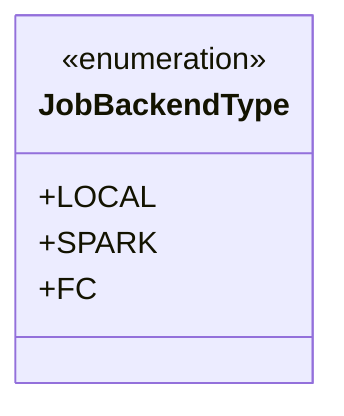
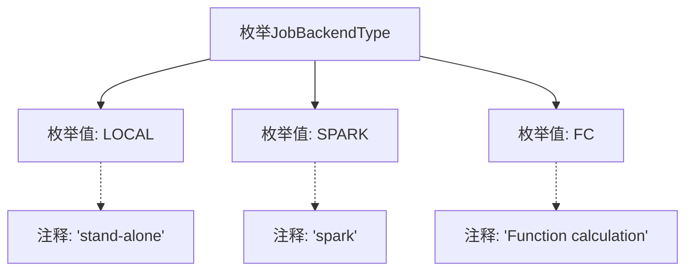

# 基础信息

|      |      |
|------|------|
| 名称 | JobBackendType |
| 编码语言 | .java |
| 代码路径 | WeFe/common/java/common-wefe/src/main/java/com/welab/wefe/common/wefe/enums/JobBackendType.java |
| 包名 | com.welab.wefe.common.wefe.enums |
| 依赖项 | [] |
| 概述说明 | JobBackendType枚举定义了三种作业后端类型：独立本地模式LOCAL、Spark计算框架SPARK和函数计算FC。 |

# 说明

该代码定义了一个名为JobBackendType的枚举类型，包含三个枚举值：LOCAL表示独立运行模式，SPARK表示基于Spark框架的运行模式，FC表示基于函数计算的运行模式。每个枚举值都有对应的注释说明其用途。

# 类列表 Class Summary

| 名称   | 类型  | 说明 |
|-------|------|-------------|
| JobBackendType | enum | JobBackendType枚举定义三种作业后端类型：LOCAL（独立运行）、SPARK（Spark引擎）、FC（函数计算）。 |

## 类 JobBackendType

|      |      |
|------|------|
| 访问范围 | public |
| 类型 | enum |
| 名称 | JobBackendType |
| 说明 | JobBackendType枚举定义三种作业后端类型：LOCAL（独立运行）、SPARK（Spark引擎）、FC（函数计算）。 |

### UML类图

这段代码定义了一个名为JobBackendType的枚举类型，包含三个枚举常量：LOCAL（表示独立运行模式）、SPARK（表示Spark计算引擎）和FC（表示函数计算）。枚举类型用于表示一组固定的常量值，这里主要用于标识作业运行的后端类型。每个枚举常量都有对应的注释说明其用途，这种设计常用于系统配置或模式选择场景，确保类型安全并避免无效参数。

### 内部方法调用关系图

这段代码定义了一个名为JobBackendType的枚举类型，包含三个枚举值：LOCAL、SPARK和FC，分别对应不同的后端作业类型。每个枚举值都有对应的注释说明其用途：LOCAL表示独立运行模式，SPARK表示基于Spark框架运行，FC表示函数计算模式。该枚举主要用于标识和区分不同类型的后端作业执行环境。

### 字段列表 Field List

| 名称  | 类型  | 说明 |
|-------|-------|------|

### 方法列表

| 名称  | 类型  | 说明 |
|-------|-------|------|

