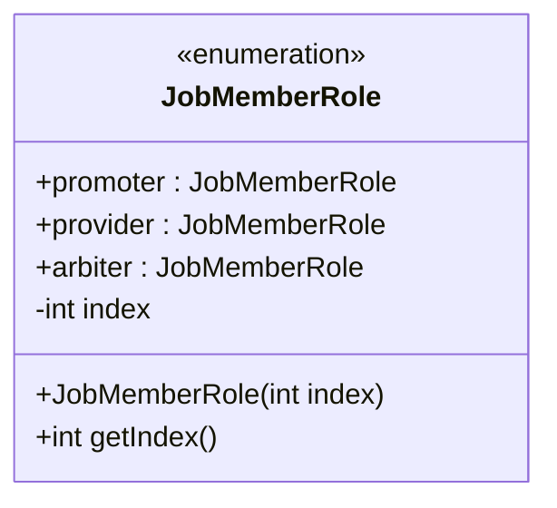
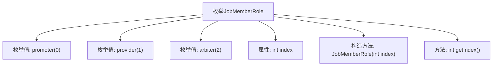

# 基础信息

|      |      |
|------|------|
| 名称 | JobMemberRole |
| 编码语言 | .java |
| 代码路径 | WeFe/common/java/common-wefe/src/main/java/com/welab/wefe/common/wefe/enums/JobMemberRole.java |
| 包名 | com.welab.wefe.common.wefe.enums |
| 依赖项 | [] |
| 概述说明 | 枚举JobMemberRole定义任务成员角色：发起者(promoter)、协作者(provider)、仲裁者(arbiter)，各角色有对应序号index。 |

# 说明

该内容定义了一个名为JobMemberRole的枚举类型，包含三个角色：promoter（任务发起者，序号0）、provider（任务协作者，序号1）和arbiter（仲裁者，序号2）。每个枚举值都有一个整型的index属性表示排序序号，并通过构造函数初始化。枚举提供了getIndex方法用于获取序号值。该枚举用于标识任务成员的不同角色类型及其顺序。

# 类列表 Class Summary

| 名称   | 类型  | 说明 |
|-------|------|-------------|
| JobMemberRole | enum | JobMemberRole枚举定义了任务成员角色：发起者(promoter)、协作者(provider)、仲裁者(arbiter)，每个角色有对应的序号index。 |

## 类 JobMemberRole

|      |      |
|------|------|
| 访问范围 | public |
| 类型 | enum |
| 名称 | JobMemberRole |
| 说明 | JobMemberRole枚举定义了任务成员角色：发起者(promoter)、协作者(provider)、仲裁者(arbiter)，每个角色有对应的序号index。 |

### UML类图

这段代码定义了一个枚举类型JobMemberRole，包含三个枚举常量：promoter、provider和arbiter，分别表示任务发起者、任务协作者和仲裁者。每个枚举常量都有一个关联的整型index值，通过构造函数初始化，并提供了getIndex()方法获取该值。枚举类型用于表示一组固定的常量，这里用于区分不同的任务成员角色及其排序序号。

### 内部方法调用关系图

该流程图展示了JobMemberRole枚举的结构，包含三个枚举值（promoter、provider、arbiter）及其对应的索引值。枚举通过私有属性index存储序号，构造方法初始化该属性，并通过getIndex()方法提供外部访问。整体描述了枚举的定义、属性初始化及方法调用的层级关系，清晰呈现了枚举类的核心组成。

### 字段列表 Field List

| 名称  | 类型  | 说明 |
|-------|-------|------|

### 方法列表

| 名称  | 类型  | 说明 |
|-------|-------|------|

