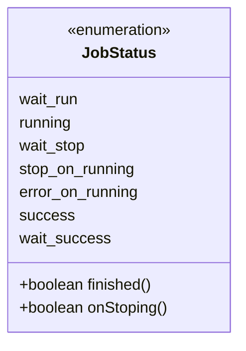
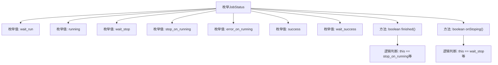

# 基础信息

|      |      |
|------|------|
| 名称 | JobStatus |
| 编码语言 | .java |
| 代码路径 | WeFe/common/java/common-wefe/src/main/java/com/welab/wefe/common/wefe/enums/JobStatus.java |
| 包名 | com.welab.wefe.common.wefe.enums |
| 依赖项 | [] |
| 概述说明 | JobStatus枚举定义任务状态：等待运行、运行中、等待结束、手动停止、异常终止、成功、等待成功。包含检查任务是否结束和是否正在停止的方法。 |

# 说明

该枚举定义了作业状态的七种类型：等待运行、运行中、等待结束、手动停止、运行异常、成功结束、等待成功。包含两个方法：finished判断状态是否为停止、异常或成功；onStoping判断状态是否为等待结束或等待成功。

# 类列表 Class Summary

| 名称   | 类型  | 说明 |
|-------|------|-------------|
| JobStatus | enum | JobStatus枚举定义任务状态：等待运行、运行中、等待结束、手动停止、异常终止、成功、等待成功。包含检查任务完成和停止状态的方法。 |

## 类 JobStatus

|      |      |
|------|------|
| 访问范围 | public |
| 类型 | enum |
| 名称 | JobStatus |
| 说明 | JobStatus枚举定义任务状态：等待运行、运行中、等待结束、手动停止、异常终止、成功、等待成功。包含检查任务完成和停止状态的方法。 |

### UML类图

这段代码定义了一个枚举类型JobStatus，用于表示任务的不同状态及其转换关系。枚举包含7种状态：等待运行(wait_run)、运行中(running)、等待停止(wait_stop)、运行中手动停止(stop_on_running)、运行中异常结束(error_on_running)、成功(success)和等待成功(wait_success)。提供了两个方法：finished()用于判断任务是否已结束（包括正常结束、手动停止和异常结束），onStoping()用于判断任务是否处于等待停止或等待成功状态。该枚举清晰地描述了任务生命周期的各个阶段及其终止条件。

### 内部方法调用关系图

该流程图展示了JobStatus枚举的结构，包含7个状态值和2个方法。finished()方法检测任务是否结束（包含正常结束、异常结束和手动停止），onStoping()方法检测是否处于等待停止状态。枚举通过状态值和方法清晰地定义了任务生命周期中的各种状态及其判断逻辑，适用于任务状态跟踪和管理场景。

### 字段列表 Field List

| 名称  | 类型  | 说明 |
|-------|-------|------|

### 方法列表

| 名称  | 类型  | 说明 |
|-------|-------|------|

