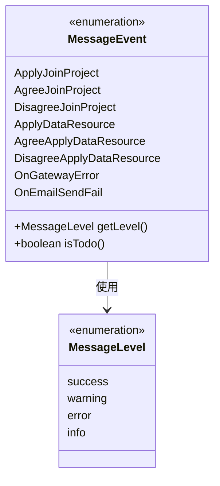
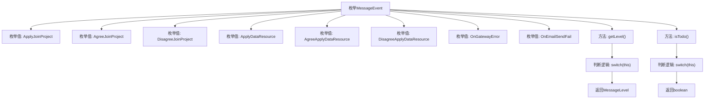

# 基础信息

|      |      |
|------|------|
| 名称 | MessageEvent |
| 编码语言 | .java |
| 代码路径 | WeFe/common/java/common-wefe/src/main/java/com/welab/wefe/common/wefe/enums/MessageEvent.java |
| 包名 | com.welab.wefe.common.wefe.enums |
| 依赖项 | [] |
| 概述说明 | 消息事件枚举，包含项目加入、数据资源申请及处理结果，网关错误和邮件发送失败事件。根据事件类型返回不同级别和待办状态。 |

# 说明

该枚举定义了多种消息事件类型，包括项目加入邀请、同意或拒绝加入项目、数据资源申请及其处理结果、网关服务错误和邮件发送失败。每个事件类型关联一个消息级别（成功、警告、错误或信息），并通过getLevel方法返回。部分事件标记为待办事项（如申请类事件），通过isTodo方法判断。整体结构清晰，用于分类和处理不同业务场景的消息事件。

# 类列表 Class Summary

| 名称   | 类型  | 说明 |
|-------|------|-------------|
| MessageEvent | enum | 枚举MessageEvent定义消息事件类型，包括项目邀请、数据申请及系统错误等，含级别判断和待办状态标记。 |

## 类 MessageEvent

|      |      |
|------|------|
| 访问范围 | public |
| 类型 | enum |
| 名称 | MessageEvent |
| 说明 | 枚举MessageEvent定义消息事件类型，包括项目邀请、数据申请及系统错误等，含级别判断和待办状态标记。 |

### UML类图

这段代码定义了一个枚举类MessageEvent，表示不同类型的消息事件，包含项目加入申请、数据资源申请及相关处理结果等。枚举提供了getLevel()方法根据事件类型返回对应的消息级别(MessageLevel枚举)，以及isTodo()方法判断是否需要处理。类图清晰地展示了MessageEvent枚举与MessageLevel枚举之间的依赖关系，体现了消息事件分类和级别判定的逻辑结构。

### 内部方法调用关系图

这段代码定义了一个MessageEvent枚举，包含8种消息事件类型和2个方法。getLevel()方法根据事件类型返回对应的消息等级（success/warning/error/info），isTodo()方法判断事件是否需要处理（true/false）。流程图清晰展示了枚举结构和方法逻辑分支，其中getLevel()和isTodo()都通过switch语句实现条件判断，分别返回MessageLevel枚举和布尔值。

### 字段列表 Field List

| 名称  | 类型  | 说明 |
|-------|-------|------|

### 方法列表

| 名称  | 类型  | 说明 |
|-------|-------|------|

