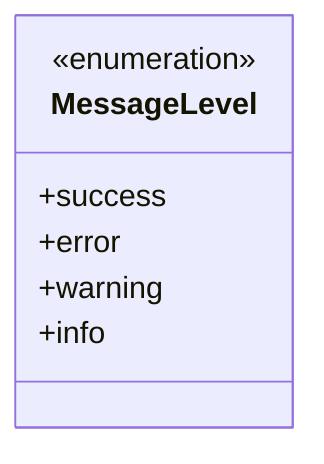
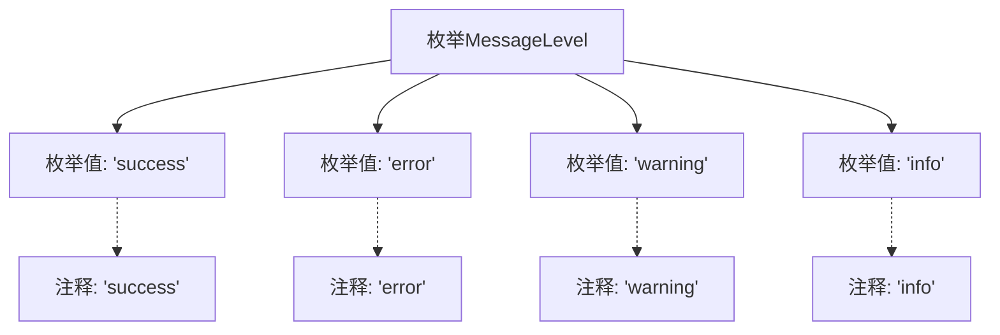

# 基础信息

|      |      |
|------|------|
| 名称 | MessageLevel |
| 编码语言 | .java |
| 代码路径 | WeFe/common/java/common-wefe/src/main/java/com/welab/wefe/common/wefe/enums/MessageLevel.java |
| 包名 | com.welab.wefe.common.wefe.enums |
| 依赖项 | [] |
| 概述说明 | 定义消息级别的枚举，包含四种类型：成功、错误、警告和信息。 |

# 说明

该内容定义了一个名为MessageLevel的枚举类型，包含四个枚举值：success表示成功状态，error表示错误状态，warning表示警告状态，info表示信息状态。每个枚举值都有对应的注释说明其用途。该枚举用于表示消息的不同级别或类型。

# 类列表 Class Summary

| 名称   | 类型  | 说明 |
|-------|------|-------------|
| MessageLevel | enum | 定义了消息级别的枚举类型，包含四种状态：成功、错误、警告和信息。 |

## 类 MessageLevel

|      |      |
|------|------|
| 访问范围 | public |
| 类型 | enum |
| 名称 | MessageLevel |
| 说明 | 定义了消息级别的枚举类型，包含四种状态：成功、错误、警告和信息。 |

### UML类图

这段代码定义了一个名为MessageLevel的枚举类型，包含四个枚举常量：success、error、warning和info。每个枚举常量都带有对应的注释说明其用途。枚举类型通常用于表示一组固定的常量值，这里用于表示消息的不同级别。该枚举可以用于分类或标记不同重要程度的消息，例如在日志系统或用户界面中区分不同类型的提示信息。

### 内部方法调用关系图

该流程图展示了MessageLevel枚举的结构，包含四个枚举值（success、error、warning、info）及其对应的注释说明。每个枚举值通过虚线连接到其文档注释，清晰地呈现了枚举定义与文档的关联关系。这种结构常用于定义具有固定选项集的类型，适用于状态标记或分类场景。

### 字段列表 Field List

| 名称  | 类型  | 说明 |
|-------|-------|------|

### 方法列表

| 名称  | 类型  | 说明 |
|-------|-------|------|

