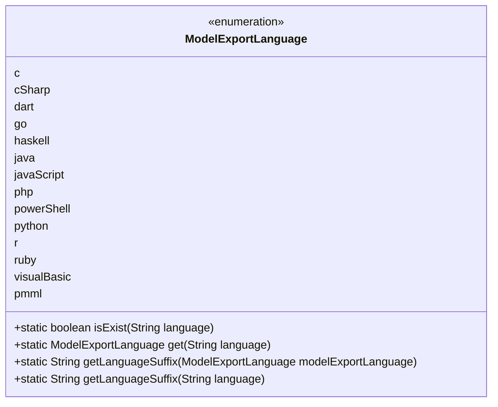
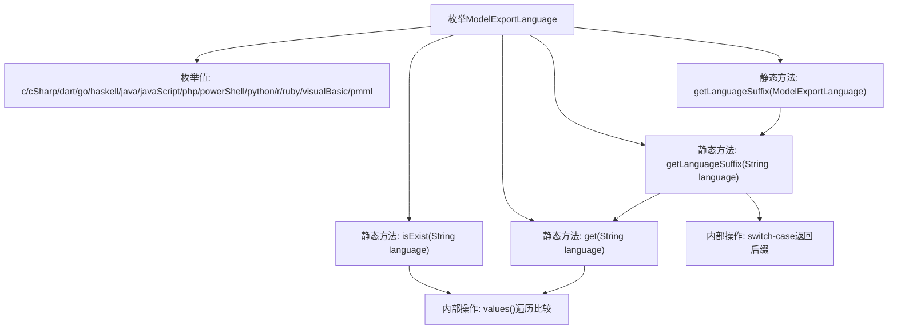

# 基础信息

|      |      |
|------|------|
| 名称 | ModelExportLanguage |
| 编码语言 | .java |
| 代码路径 | WeFe/common/java/common-wefe/src/main/java/com/welab/wefe/common/wefe/enums/ModelExportLanguage.java |
| 包名 | com.welab.wefe.common.wefe.enums |
| 依赖项 | [] |
| 概述说明 | 枚举类ModelExportLanguage定义了14种编程语言和PMML，提供方法检查语言存在性、获取枚举实例及对应文件后缀。 |

# 说明

该枚举类定义了多种模型导出语言类型，包括c、cSharp、dart等14种语言。提供了三个静态方法：isExist用于检查语言是否存在，get用于获取对应枚举实例，getLanguageSuffix用于获取语言后缀名。后缀名映射规则明确，如c对应"c"，python对应"py"等。方法均处理空值情况，返回空字符串或null。

# 类列表 Class Summary

| 名称   | 类型  | 说明 |
|-------|------|-------------|
| ModelExportLanguage | enum | 枚举类ModelExportLanguage定义了多种编程语言，提供检查存在性、获取实例及获取文件后缀的方法。 |

## 类 ModelExportLanguage

|      |      |
|------|------|
| 访问范围 | public |
| 类型 | enum |
| 名称 | ModelExportLanguage |
| 说明 | 枚举类ModelExportLanguage定义了多种编程语言，提供检查存在性、获取实例及获取文件后缀的方法。 |

### UML类图

该代码定义了一个枚举类`ModelExportLanguage`，用于表示不同编程语言的导出格式。枚举包含14种语言类型，并提供了4个静态方法：`isExist()`检查语言是否存在，`get()`获取对应枚举实例，`getLanguageSuffix()`获取语言后缀名（重载方法支持枚举实例或字符串输入）。类图清晰地展示了枚举值和方法的访问权限，其中所有方法均为公有静态方法，便于直接通过类名调用。

### 内部方法调用关系图

该流程图展示了ModelExportLanguage枚举的核心结构，包含14种编程语言枚举值和4个关键静态方法。isExist()和get()方法通过遍历枚举值进行匹配判断，getLanguageSuffix()通过双重方法重载实现后缀获取，最终版本采用switch-case结构返回各语言的标准文件后缀名。整个设计实现了语言类型验证、枚举实例获取和文件后缀转换三大功能。

### 字段列表 Field List

| 名称  | 类型  | 说明 |
|-------|-------|------|

### 方法列表

| 名称  | 类型  | 说明 |
|-------|-------|------|

