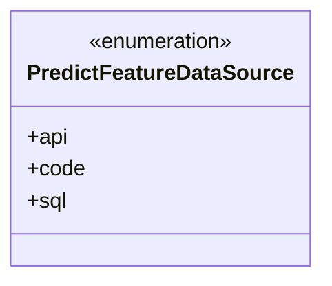
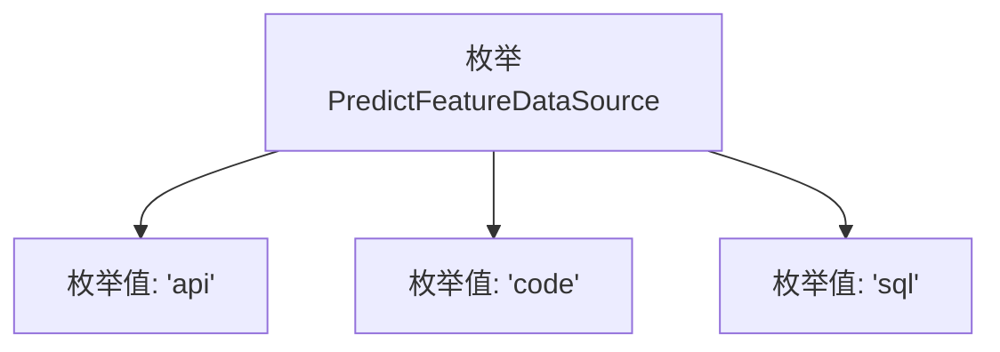

# 基础信息

|      |      |
|------|------|
| 名称 | PredictFeatureDataSource |
| 编码语言 | .java |
| 代码路径 | WeFe/common/java/common-wefe/src/main/java/com/welab/wefe/common/wefe/enums/PredictFeatureDataSource.java |
| 包名 | com.welab.wefe.common.wefe.enums |
| 依赖项 | [] |
| 概述说明 | PredictFeatureDataSource枚举定义了三种数据来源：api、code和sql。 |

# 说明

该内容定义了一个名为PredictFeatureDataSource的公共枚举类型，包含三个枚举常量：api、code和sql。每个枚举常量都附带简要注释说明其含义，分别代表API、代码和SQL三种数据来源类型。该枚举可能用于标识预测功能的数据来源渠道。

# 类列表 Class Summary

| 名称   | 类型  | 说明 |
|-------|------|-------------|
| PredictFeatureDataSource | enum | 枚举PredictFeatureDataSource定义三种数据源类型：api、code、sql。 |

## 类 PredictFeatureDataSource

|      |      |
|------|------|
| 访问范围 | public |
| 类型 | enum |
| 名称 | PredictFeatureDataSource |
| 说明 | 枚举PredictFeatureDataSource定义三种数据源类型：api、code、sql。 |

### UML类图

这段代码定义了一个名为PredictFeatureDataSource的枚举类型，包含三个枚举常量：api、code和sql。枚举用于表示预测特征数据的不同来源类型，每个来源都有明确的文档注释说明其含义。作为枚举类，它提供了类型安全的常量集合，适合在需要限定数据来源的场景中使用，能有效避免使用字符串或整数常量带来的类型不安全问题。

### 内部方法调用关系图

该流程图展示了PredictFeatureDataSource枚举的结构，包含三个预定义常量值：api、code和sql。枚举类型用于表示固定集合的数据源类型，每个值对应不同的特征数据获取方式。这种设计模式确保了类型安全性和代码可读性，适用于需要严格限定输入范围的场景。

### 字段列表 Field List

| 名称  | 类型  | 说明 |
|-------|-------|------|

### 方法列表

| 名称  | 类型  | 说明 |
|-------|-------|------|

