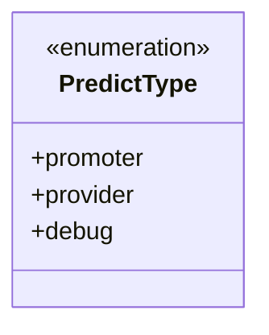
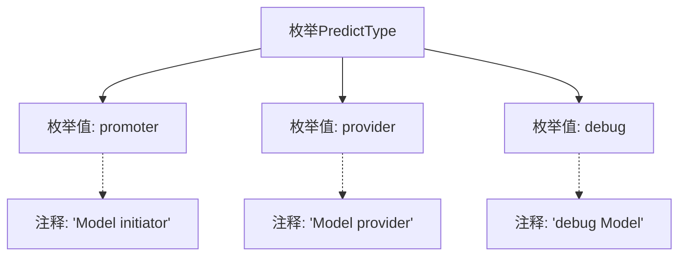

# 基础信息

|      |      |
|------|------|
| 名称 | PredictType |
| 编码语言 | .java |
| 代码路径 | WeFe/common/java/common-wefe/src/main/java/com/welab/wefe/common/wefe/enums/PredictType.java |
| 包名 | com.welab.wefe.common.wefe.enums |
| 依赖项 | [] |
| 概述说明 | 枚举PredictType定义三种类型：promoter（模型发起者）、provider（模型提供者）、debug（调试模型）。 |

# 说明

该内容定义了一个名为PredictType的枚举类型，包含三个枚举值：promoter表示模型发起者，provider表示模型提供者，debug表示调试模型。每个枚举值都有对应的注释说明其用途。

# 类列表 Class Summary

| 名称   | 类型  | 说明 |
|-------|------|-------------|
| PredictType | enum | PredictType枚举定义三种类型：发起者promoter、提供者provider和调试debug。 |

## 类 PredictType

|      |      |
|------|------|
| 访问范围 | public |
| 类型 | enum |
| 名称 | PredictType |
| 说明 | PredictType枚举定义三种类型：发起者promoter、提供者provider和调试debug。 |

### UML类图

这段代码定义了一个名为PredictType的枚举类型，包含三个枚举常量：promoter（模型发起者）、provider（模型提供者）和debug（调试模型）。枚举类型用于表示一组固定的常量值，每个常量都有特定的业务含义。该枚举可能用于区分不同类型的预测模型参与者或模式，在系统中起到标识和分类的作用。枚举类型在类图中用<<enumeration>>标记，清晰地展示了其结构和可用选项。

### 内部方法调用关系图

该流程图展示了PredictType枚举的结构，包含三个枚举值（promoter、provider、debug）及其对应的注释说明。promoter标注为模型发起者，provider标注为模型提供者，debug标注为调试模型。图形清晰呈现了枚举定义与各值之间的关联关系，通过虚线连接显示注释与枚举值的对应关系。

### 字段列表 Field List

| 名称  | 类型  | 说明 |
|-------|-------|------|

### 方法列表

| 名称  | 类型  | 说明 |
|-------|-------|------|

